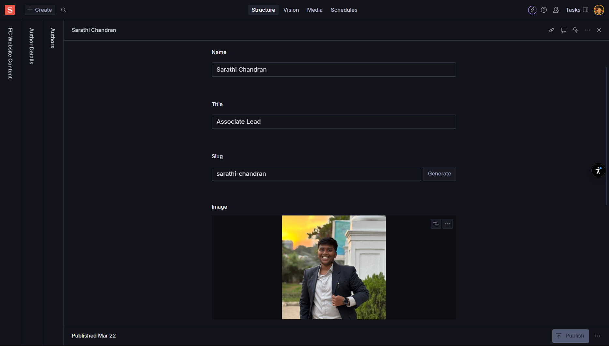

import { Card, CardGrid, Aside, Icon, LinkCard } from '@astrojs/starlight/components';
import { Quiz, QuizOption, List } from 'starlight-videos/components';

<Aside type="note" icon="setting">
  <b>Component Reference</b>  
  This is a reusable component used across multiple pages including Events, Blog Posts, and other authored content
</Aside>

<List title="Before you start" variant="caution">
- [ ] Gather high-quality professional headshots for all authors (800x800px minimum)
- [ ] Prepare author biographies in both short (40-80 words) and long formats
- [ ] Collect social media profiles and professional links with permissions
- [ ] Define your expertise/tag taxonomy to maintain consistency across authors
</List>

<List title="What you'll find in this reference" variant="note">
- Complete author profile creation and management workflows
- Byline and author card configuration for consistent presentation
- Social media integration and professional link management
- Editorial guidelines for maintaining credible and consistent authoring
- SEO optimization for author pages and content attribution
- Governance practices for author maintenance and quality assurance
</List>

## What is the Author Component?

The Author component is a reusable content type for people who write or appear as bylined contributors across your site. This includes founders, team members, guest writers, speakers, and other content creators. It powers bylines on posts, author cards, speaker profiles, and optionally dedicated author profile pages.

<CardGrid>
  <Card title="Reusable Profiles" icon="approve-check-circle">
    One author profile powers bylines across blog posts, event writeups, and other content
  </Card>
  <Card title="Professional Presentation" icon="star">
    Consistent headshots, bios, and social links maintain professional credibility
  </Card>
  <Card title="Content Attribution" icon="external">
    Clear authorship builds thought leadership and expertise recognition
  </Card>
</CardGrid>

---

## Core Author Fields

### Essential Information

<CardGrid>
  <Card title="Name" icon="pencil">
    **Required** - Full name as it should appear on bylines
     *Example: "Priya Sharma" or "Dr. Rajesh Kumar"*
     *Use consistent casing and diacritics; match public presence*
  </Card>
  <Card title="Slug" icon="external">
    **Required** - URL-friendly identifier (if author pages are routable)
     *Auto-generated from Name; keep short and readable*
     *Example: "priya-sharma" or "john-doe"*
  </Card>
  <Card title="Role/Title" icon="document">
    **Required** - Author's current title or position
     *Example: "Co-founder & CEO", "Head of Growth", "Guest Contributor"*
     *Keep current; update when author's title changes*
  </Card>
  <Card title="Headshot/Image" icon="seti:image">
    **Required** - Professional photo
     *Square or portrait format, 800×800px or larger*
     *Add descriptive Alt Text: "Portrait of Jane Doe"*
     *Prefer clean background for consistency*
  </Card>
</CardGrid>

### Biography Content

<CardGrid>
  <Card title="Short Bio" icon="document">
    **Required** - Brief summary for cards and bylines
     *1-3 sentences, 40-80 words*
     *Write in third person unless site uses first person consistently*
     *Focus on expertise relevant to content topics*
  </Card>
  <Card title="Primary Link" icon="external">
    **Optional/Recommended** - Main professional profile
     *Personal website, LinkedIn, or company profile*
     *Use https:// format for external links*
  </Card>
</CardGrid>

---

## Extended Author Fields

### Detailed Profile Information

<CardGrid>
  <Card title="Long Bio" icon="open-book">
    **Optional** - Full profile for dedicated author pages
     *Rich text with headings, lists, and links*
     *Include background, expertise, achievements*
     *Add disclosures for investments or affiliations*
  </Card>
  <Card title="Pronouns" icon="approve-check">
    **Optional** - Gender pronouns for inclusive presentation
     *Examples: "she/her", "he/him", "they/them"*
     *Displays in author cards and profiles*
  </Card>
  <Card title="Location" icon="setting">
    **Optional** - Geographic location
     *Examples: "Mumbai, India", "Remote", "San Francisco Bay Area"*
     *Useful for event attribution and networking*
  </Card>
</CardGrid>

### Professional Classification

<CardGrid>
  <Card title="Expertise/Tags" icon="setting">
    **Optional** - Topics the author writes about
     *Array of strings: "fintech", "growth", "pricing", "fundraising"*
     *Use controlled vocabulary to keep filters organized*
     *Helps readers find expertise-specific content*
  </Card>
  <Card title="Affiliations" icon="external">
    **Optional** - Companies, funds, or communities
     *Array of organization names or references*
     *Examples: "Y Combinator", "Sequoia Capital", "Founders Club"*
  </Card>
  <Card title="Availability" icon="approve-check">
    **Optional** - Services offered
     *Boolean fields: "Speaking", "Advising", "Investing"*
     *Include optional notes or booking links*
  </Card>
</CardGrid>

---

## Social Media Integration

### Social Links Configuration

<CardGrid>
  <Card title="Provider/Label" icon="external">
    **Required** - Platform name
     *Examples: "LinkedIn", "X/Twitter", "GitHub", "Substack", "YouTube"*
     *Use consistent naming across all authors*
  </Card>
  <Card title="URL" icon="external">
    **Required** - Full profile URL
     *Must start with https://*
     *Link to official/active profiles only*
     *Avoid duplicates across provider types*
  </Card>
  <Card title="Handle" icon="pencil">
    **Optional** - Username for display
     *Example: @username*
     *Useful for social media attribution*
  </Card>
</CardGrid>

### Professional Links Priority

<CardGrid stagger>
  <Card title="Essential Platforms" icon="star">
    **LinkedIn** - Professional networking (highly recommended)
     **Personal Website** - Portfolio or professional site
     **Company Profile** - If representing an organization
  </Card>
  <Card title="Content Platforms" icon="open-book">
    **Substack/Newsletter** - For regular content creators
     **Medium** - For published articles and thought leadership
     **GitHub** - For technical contributors and developers
  </Card>
  <Card title="Social Platforms" icon="external">
    **X/Twitter** - For industry conversations and updates
     **YouTube** - For video content and speaking
     **Instagram** - For behind-the-scenes and culture content
  </Card>
</CardGrid>

---

## Display and Management Options

### Visibility Controls

<CardGrid>
  <Card title="Featured" icon="star">
    **Optional** - Boolean toggle for highlighting
     *Surfaces author on listing pages and carousels*
     *Use for key team members, frequent contributors*
     *Rotate periodically to showcase different voices*
  </Card>
  <Card title="Visible/Active" icon="approve-check">
    **Optional** - Show/hide toggle
     *Hide authors without deleting their profile*
     *Preserves historical bylines when toggled off*
     *Useful for temporary contributors or departed team members*
  </Card>
  <Card title="Sort Order/Priority" icon="list-format">
    **Optional** - Numerical ordering
     *Lower numbers appear first in manual ordering*
     *Examples: 1, 2, 3 for leadership team hierarchy*
  </Card>
</CardGrid>

### Content Relationships

<CardGrid>
  <Card title="Related Content" icon="external">
    **Optional** - Curated posts, videos, or resources
     *Manually selected content to feature on author pages*
     *Showcase signature posts or key contributions*
  </Card>
  <Card title="Authored Posts" icon="list-format">
    **Auto-Generated** - Posts by this author
     *Often computed automatically by querying posts*
     *Manual curation can override or supplement*
  </Card>
</CardGrid>

---

## SEO and Social Optimization

### Search Engine Optimization

<CardGrid>
  <Card title="Meta Information" icon="setting">
    **Meta Title** - Format: "Author Name | Brand"
     **Meta Description** - 150-160 characters including core topics
     **OG Image Override** - Custom social sharing image if needed
  </Card>
  <Card title="Structured Data" icon="setting">
    **Schema.org Person** - Developer implementation
     *Includes name, jobTitle, image, sameAs links*
     *Enhances search engine understanding*
  </Card>
</CardGrid>

### Social Media Preview

<CardGrid>
  <Card title="OG/Twitter Bio Override" icon="external">
    **Optional** - Shorter bio for social previews
     *Customized for social media card constraints*
     *Different from main Short Bio if needed*
  </Card>
  <Card title="Branded Backgrounds" icon="seti:image">
    **OG Image** - Custom image for social sharing
     *Author headshot with branded background*
     *Consistent preview appearance across platforms*
  </Card>
</CardGrid>

---

## How to Create and Manage Authors

### Step-by-Step Creation

1. **Create Author Document** in Sanity Studio
2. **Fill Core Information**:
   - Name (as it should appear on bylines)
   - Role/Title (current position)
   - Generate Slug (if author pages exist)
3. **Upload Professional Headshot**:
   - 800×800px or larger
   - Square or portrait format
   - Add descriptive Alt Text
4. **Write Biography Content**:
   - Short Bio (40-80 words for cards/bylines)
   - Long Bio (rich text for author pages)
   - Use third person unless brand uses first person
5. **Add Social and Professional Links**:
   - Primary Link (website or LinkedIn)
   - Social Links array with Provider + URL
   - Test all links for accuracy
6. **Configure Classification**:
   - Expertise/Tags (topics they write about)
   - Affiliations (companies, organizations)
   - Availability (speaking, advising, investing)
7. **Set Display Options**:
   - Featured toggle for key contributors
   - Visible/Active (on by default)
   - Sort Order if using manual ordering
8. **Complete SEO Fields**:
   - Meta Title and Description for author pages
   - OG Image override if needed
9. **Publish and Test**:
   - Verify author displays correctly on content
   - Test social sharing previews

### Using Authors in Content

<CardGrid>
  <Card title="Blog Posts" icon="open-book">
    **Author Field** - Reference to Author document
     *Multiple authors supported with drag-to-reorder*
     *Lead author typically appears first*
  </Card>
  <Card title="Event Writeups" icon="list-format">
    **Speaker Profiles** - Can reference Author documents
     *Reuses headshot, bio, and social links*
     *Maintains consistency across event documentation*
  </Card>
  <Card title="Team Pages" icon="approve-check-circle">
    **Team Member Profiles** - May integrate with Author system
     *Single source of truth for staff information*
     *Consistent presentation across site sections*
  </Card>
</CardGrid>

---

## Editorial Guidelines

### Content Standards

<CardGrid>
  <Card title="Tone and Voice" icon="pencil">
    **Third Person Preferred** - "Jane leads growth at..." unless brand uses first person uniformly
     **Relevance Focus** - Tie bios to topics the author writes about
     **Professional Tone** - Maintain credibility and expertise positioning
  </Card>
  <Card title="Credibility Building" icon="star">
    **Expertise Connection** - Link bio to author's content topics
     **Thought Leadership** - Reference signature posts or talks in Related Content
     **Disclosures** - Include investment or advisory disclosures where relevant
  </Card>
</CardGrid>

### Content Maintenance

<CardGrid>
  <Card title="Regular Updates" icon="seti:clock">
    **Quarterly Reviews** - Refresh bios and check for role changes
     **Link Validation** - Test all social and professional links
     **Image Updates** - Replace low-resolution images when available
  </Card>
  <Card title="Consistency Maintenance" icon="approve-check">
    **Expertise Taxonomy** - Use controlled vocabulary for tags
     **Image Standards** - Maintain consistent crop/aspect across authors
     **Featured Rotation** - Rotate featured authors to showcase different voices
  </Card>
</CardGrid>

---

## Governance and Quality Assurance

### Author Management Best Practices

<CardGrid>
  <Card title="Duplicate Prevention" icon="warning">
    **One Document Per Person** - Avoid creating duplicate author profiles
     **Merge Process** - If duplicates exist, merge and update all references
     **Naming Convention** - Use consistent full names across all authors
  </Card>
  <Card title="Lifecycle Management" icon="setting">
    **Deactivation Process** - Toggle Visible/Active off for departed team members
     **Historical Preservation** - Keep documents to maintain byline integrity
     **Role Updates** - Refresh titles and affiliations as they change
  </Card>
</CardGrid>

### Quality Assurance Checklist

<CardGrid>
  <Card title="Content Quality" icon="star">
    **Bio Relevance** - Expertise aligns with authored content
     **Professional Presentation** - Consistent tone and formatting
     **Accuracy Verification** - All facts, titles, and affiliations current
  </Card>
  <Card title="Technical Standards" icon="setting">
    **Link Functionality** - All URLs tested and working
     **Image Quality** - High-resolution headshots with proper Alt text
     **SEO Completion** - Meta fields completed for author pages
  </Card>
</CardGrid>

---

## Pre-Publish Checklist

<List title="Before Publishing Author Profiles" variant="caution">
- Name, Slug (if applicable), and Role/Title are correct and current
- Professional headshot uploaded with meaningful Alt Text description
- Short Bio is concise, relevant, and written in consistent voice/person
- Social links added (LinkedIn recommended) and all URLs tested for functionality
- Expertise/Tags align with established site taxonomy and authored content
- SEO fields completed for author pages (Meta Title, Description, OG Image)
- Visible/Active toggle is on; Featured toggle set appropriately
- All professional affiliations and disclosures included where relevant
</List>

---

## Test Your Knowledge

<Quiz title="What's the recommended word count for Short Bio?">
  <QuizOption>20-30 words</QuizOption>
  <QuizOption correct>40-80 words</QuizOption>
  <QuizOption>100+ words</QuizOption>
</Quiz>

<Quiz title="Which social platform is most highly recommended for authors?">
  <QuizOption>X/Twitter</QuizOption>
  <QuizOption correct>LinkedIn</QuizOption>
  <QuizOption>Instagram</QuizOption>
</Quiz>

<Quiz title="What should you do with author profiles for departed team members?">
  <QuizOption>Delete the profile completely</QuizOption>
  <QuizOption correct>Toggle Visible/Active off to preserve historical bylines</QuizOption>
  <QuizOption>Keep everything exactly the same</QuizOption>
</Quiz>

<Quiz title="What person should author bios typically be written in?">
  <QuizOption>First person</QuizOption>
  <QuizOption correct>Third person (unless brand uses first person consistently)</QuizOption>
  <QuizOption>Second person</QuizOption>
</Quiz>

<Quiz title="How often should you review and update author profiles?">
  <QuizOption>Monthly</QuizOption>
  <QuizOption correct>Quarterly</QuizOption>
  <QuizOption>Annually</QuizOption>
</Quiz>

---

## Integration with Other Components

### Content Integration Points

<CardGrid stagger>
  <Card title="Blog Posts" icon="open-book">
    **Byline Attribution** - Author name, headshot, and short bio
     **Multiple Authors** - Support for co-authored content
     **Author Pages** - Link to full author profiles and related content
  </Card>
  <Card title="Event Writeups" icon="list-format">
    **Speaker Profiles** - Reuse author data for event speakers
     **Consistent Presentation** - Same headshots and bios across contexts
     **Social Attribution** - Speaker social links and professional profiles
  </Card>
  <Card title="Team Pages" icon="approve-check-circle">
    **Staff Profiles** - Integration with team member management
     **Role Consistency** - Synchronized job titles across site sections
     **Biography Reuse** - Same professional summaries in multiple contexts
  </Card>
</CardGrid>

### Cross-Component Benefits

<CardGrid>
  <Card title="Consistency" icon="approve-check">
    **Single Source of Truth** - One profile, multiple display contexts
     **Professional Presentation** - Consistent headshots and bios
     **Link Management** - Centralized social media and professional links
  </Card>
  <Card title="Efficiency" icon="setting">
    **Reduced Duplication** - No need to recreate profiles for each context
     **Centralized Updates** - Change once, update everywhere
     **Quality Assurance** - Single point for maintaining author information
  </Card>
</CardGrid>

---

## Quick Reference

### Required Fields Summary
- ✅ **Name** - Full name for bylines
- ✅ **Slug** - URL identifier (if author pages enabled)
- ✅ **Role/Title** - Current professional position
- ✅ **Headshot** - Professional photo with Alt text
- ✅ **Short Bio** - 40-80 word summary for cards/bylines

### Recommended Fields
- ⚠️ **Primary Link** - Website or LinkedIn profile
- ⚠️ **Social Links** - Professional social media profiles
- ⚠️ **Expertise/Tags** - Topics the author writes about
- ⚠️ **Long Bio** - Full profile for author pages

### Content Guidelines
- **Third Person Voice** - Unless brand consistently uses first person
- **Professional Focus** - Expertise relevant to authored content
- **Regular Updates** - Quarterly review and refresh cycle
- **Link Quality** - Test all URLs for functionality

### Image Specifications
- **Minimum Size** - 800×800px or larger
- **Format** - Square or portrait orientation
- **Background** - Clean, professional backgrounds preferred
- **Alt Text** - Always include descriptive Alt text

<List title="What did you learn?" variant="success">
- How to create comprehensive author profiles with professional headshots and biographies
- Social media integration strategies for building author credibility and reach
- Editorial guidelines for maintaining consistent voice and professional presentation
- Content relationship management between authors and their published work
- SEO optimization techniques for author pages and content attribution
- Governance practices for author lifecycle management and quality assurance
- Integration patterns with other components like events, blog posts, and team pages
- Best practices for maintaining author information accuracy and professional standards
</List>

<Aside type="tip" icon="star">
  **Component Strategy**: The Author component serves as a foundation for content credibility across your site. Invest in high-quality profiles with professional headshots and well-written biographies to enhance your content's authority and build thought leadership for your contributors.
</Aside>
