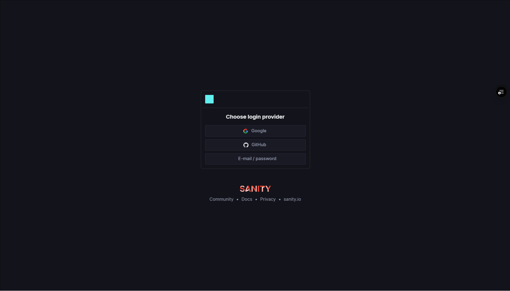
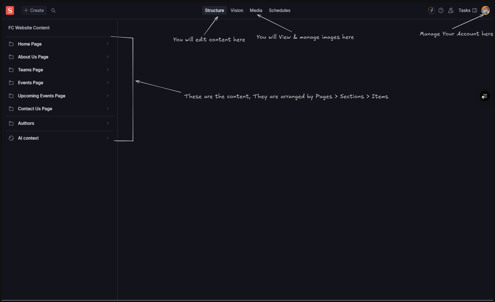
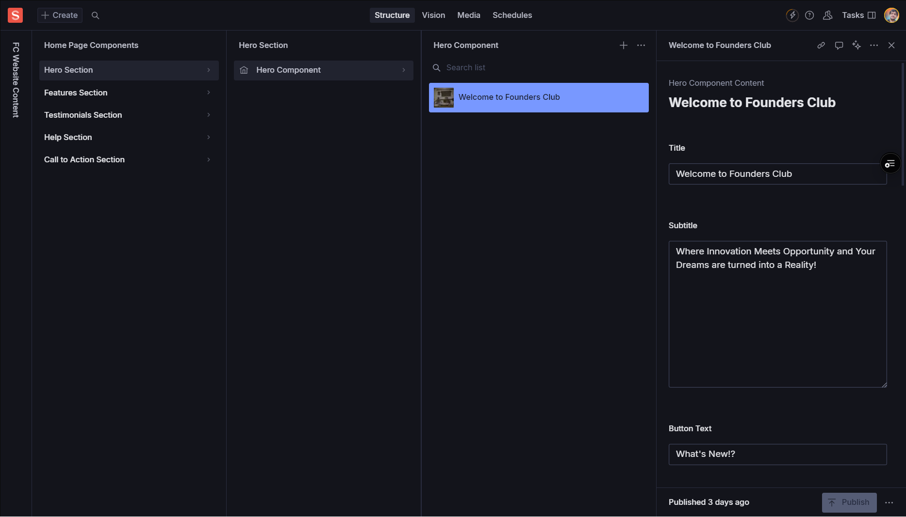

import { Card, CardGrid, Aside, Icon, LinkCard } from '@astrojs/starlight/components';
import { Quiz, QuizOption, List } from 'starlight-videos/components';

<Aside type="tip" icon="star">
  <b>For Creative & Content Teams</b>  
  This guide will help you navigate Sanity Studio and update website content efficiently. No technical background required!
</Aside>

## Introduction

Welcome to the Sanity CMS Content Editing Guide! This document provides a comprehensive walkthrough for the creative and content-writing teams on how to use Sanity CMS to edit and update the Founders Club website content.

<CardGrid>
  <Card title="What is Sanity?" icon="open-book">
    Sanity is our content management system that allows you to easily edit website content without touching any code.
  </Card>
  <Card title="Who can use it?" icon="approve-check-circle">
    Creative team members, content writers, and anyone with proper access credentials.
  </Card>
  <Card title="What can you edit?" icon="pencil">
    Text, images, testimonials, FAQs, events, team information, and much more!
  </Card>
</CardGrid>

---

## Accessing Sanity Studio

### Getting Started

<CardGrid>
  <Card title="Step 1: Get Credentials" icon="email">
    Contact **Tech Lead** to receive your invitation to Sanity Studio
  </Card>
  <Card title="Step 2: Access Studio" icon="external">
    Navigate to [www.thefoundersclub.in/studio](https://www.thefoundersclub.in/studio) in your web browser
    </Card>
  <Card title="Step 3: Log In" icon="approve-check">
    Use your provided credentials to log in to the studio
  </Card>
</CardGrid>

<Aside type="note" icon="information">
  Make sure to bookmark the studio URL for easy access in the future!
</Aside>

---

## Navigating the Studio

### Understanding the Interface

<CardGrid>
  <Card title="Dashboard" icon="laptop">
    The initial screen showing recent activity and project overviews
  </Card>
  <Card title="Views" icon="list-format">
    Define the structure of different pages (Home, About Us, Events, etc.)
  </Card>
  <Card title="Page Content" icon="document">
    Define the structure of different components within each page
  </Card>
  <Card title="Documents" icon="setting">
    Individual components that you can edit (Hero sections, testimonials, etc.)
  </Card>
</CardGrid>

### Key Terminology

<Aside type="note" icon="open-book">
  <ul>
    <li><strong>Fields:</strong> Individual content elements like "Title", "Body Text", "Image", "Call to Action"</li>
    <li><strong>Components:</strong> Sections of a page like Hero Section, Features, Testimonials</li>
    <li><strong>Documents:</strong> The actual content items you can edit</li>
  </ul>
</Aside>

---

## Editing Content

### Finding Content to Edit

<CardGrid stagger>
  <Card title="Navigate to View" icon="right-arrow">
    Choose the relevant page view (e.g., "Home Page")
  </Card>
  <Card title="Select Page Content" icon="right-arrow">
    Pick the specific section (e.g., "Hero Section")
  </Card>
  <Card title="Find Document" icon="magnifier">
    Locate the document you want to edit (e.g., "Welcome to Founders Club")
  </Card>
</CardGrid>

### Editing Different Field Types

<CardGrid>
  <Card title="Text Fields" icon="pencil">
    <ul>
      <li>Click on the field to modify</li>
      <li>Type or paste your updated text</li>
      <li>Use the built-in editor for formatting (bold, italics, headings, lists)</li>
    </ul>
  </Card>
  <Card title="Image Fields" icon="seti:image">
    <ul>
      <li><strong>Upload:</strong> Click "Upload" to select from your computer</li>
      <li><strong>Select:</strong> Choose from existing Sanity asset library</li>
      <li><strong>Adjust:</strong> Resize, crop, and apply basic effects</li>
    </ul>
  </Card>
  <Card title="Other Fields" icon="setting">
    <ul>
      <li>Follow specific instructions for checkboxes</li>
      <li>Use dropdown menus appropriately</li>
      <li>Rich text editors work like mini word processors</li>
    </ul>
  </Card>
</CardGrid>

---

## Publishing Changes

### Making Changes Live

<CardGrid>
  <Card title="Save First" icon="document">
    Ensure all changed elements are saved (auto save) to preserve your edits within Sanity Studio
  </Card>
  <Card title="Publish Changes" icon="external">
    Locate and click the "Publish" button to make changes live on the website
  </Card>
  <Card title="Wait for Deploy" icon="seti:clock">
    Changes typically take **0 - 15 minutes** to appear on the website
  </Card>
</CardGrid>

<Aside type="caution" icon="warning">
  <strong>Publishing Timeline:</strong> After clicking publish, allow 15 minutes for changes to appear on the live website.
</Aside>

---

## Studio Content Structure

### Home Page Components

<CardGrid stagger>
  <LinkCard title="Banner" href="/guides/fc/studio/structure/home-page" />
  <LinkCard title="Hero Section" href="/guides/fc/studio/structure/home-page" />
  <LinkCard title="Features Section" href="/guides/fc/studio/structure/home-page" />
  <LinkCard title="Testimonials" href="/guides/fc/studio/structure/home-page" />
  <LinkCard title="Help Section" href="/guides/fc/studio/structure/home-page" />
  <LinkCard title="Call to Action" href="/guides/fc/studio/structure/home-page" />
</CardGrid>

### About Us Page Components

<CardGrid stagger>
  <LinkCard title="About Us Hero" href="/guides/fc/studio/structure/home-page" />
  <LinkCard title="Our Story" href="/guides/fc/studio/structure/home-page" />
  <LinkCard title="Timeline" href="/guides/fc/studio/structure/home-page" />
  <LinkCard title="Careers" href="/guides/fc/studio/structure/home-page" />
</CardGrid>

### Teams Page Components

<CardGrid stagger>
  <LinkCard title="Team Members" href="/guides/fc/studio/structure/home-page" />
</CardGrid>

### Events Page Components

<CardGrid stagger>
  <LinkCard title="Event Writeups" href="/guides/fc/studio/structure/home-page" />
</CardGrid>

### Upcoming Events Page Components

<CardGrid stagger>
  <LinkCard title="Upcoming Events Header" href="/guides/fc/studio/structure/home-page" />
</CardGrid>

### Contact Us Page Components

<CardGrid stagger>
  <LinkCard title="Contact Us" href="/guides/fc/studio/structure/home-page" />
</CardGrid>

---

## Important Considerations

<CardGrid>
  <Card title="Version History" icon="seti:clock">
    Sanity maintains version history - you can revert to previous versions if needed
  </Card>
  <Card title="Collaboration" icon="approve-check-circle">
    Be mindful when multiple users edit the same content to avoid conflicts
  </Card>
  <Card title="Content Guidelines" icon="open-book">
    Follow established style guides, brand guidelines, and content best practices
  </Card>
  <Card title="Testing" icon="magnifier">
    Always test the website after publishing to ensure everything works correctly
  </Card>
</CardGrid>

<Aside type="note" icon="information">
  Remember to preview your changes before publishing and always follow the club's brand voice and style guidelines.
</Aside>

---

## Troubleshooting

<Aside type="caution" icon="warning">
  <strong>Common Issues & Solutions</strong>
  <ul>
    <li><strong>Error messages:</strong> Check for error messages within Sanity Studio</li>
    <li><strong>Need help:</strong> Refer to Sanity documentation for troubleshooting tips</li>
    <li><strong>Technical issues:</strong> Contact the Technical team for assistance</li>
    <li><strong>Content not updating:</strong> Wait 15-20 minutes after publishing</li>
  </ul>
</Aside>

### Quick Support Contacts

<CardGrid>
  <Card title="Access Issues" icon="error">
    Contact **Tech Lead** for login problems or account access
  </Card>
  <Card title="Technical Problems" icon="setting">
    Reach out to the **Technical Team** for studio malfunctions
  </Card>
  <Card title="Content Guidelines" icon="open-book">
    Check with the **Creative Team Lead** for content standards
  </Card>
</CardGrid>

---

## Test Your Knowledge

<Quiz title="What should you do immediately after editing content in Sanity?">
  <QuizOption>Publish the changes</QuizOption>
  <QuizOption correct>Save the changes</QuizOption>
  <QuizOption>Close the browser</QuizOption>
</Quiz>

<Quiz title="How long do changes typically take to appear on the live website?">
  <QuizOption>Immediately</QuizOption>
  <QuizOption correct>15-20 minutes</QuizOption>
  <QuizOption>1 hour</QuizOption>
</Quiz>

<Quiz title="Who should you contact for Sanity Studio access?">
  <QuizOption correct>Suvan GS</QuizOption>
  <QuizOption>Technical Team</QuizOption>
  <QuizOption>Creative Team</QuizOption>
</Quiz>

<Quiz title="What is the heroComponent used for?">
  <QuizOption>Footer content</QuizOption>
  <QuizOption correct>The first thing users see on the website</QuizOption>
  <QuizOption>Contact information</QuizOption>
</Quiz>

<Quiz title="What should you check after publishing changes?" variant="tip">
  <QuizOption>Nothing needed</QuizOption>
  <QuizOption correct>Test the website to ensure everything works correctly</QuizOption>
  <QuizOption>Only the Sanity Studio</QuizOption>
</Quiz>