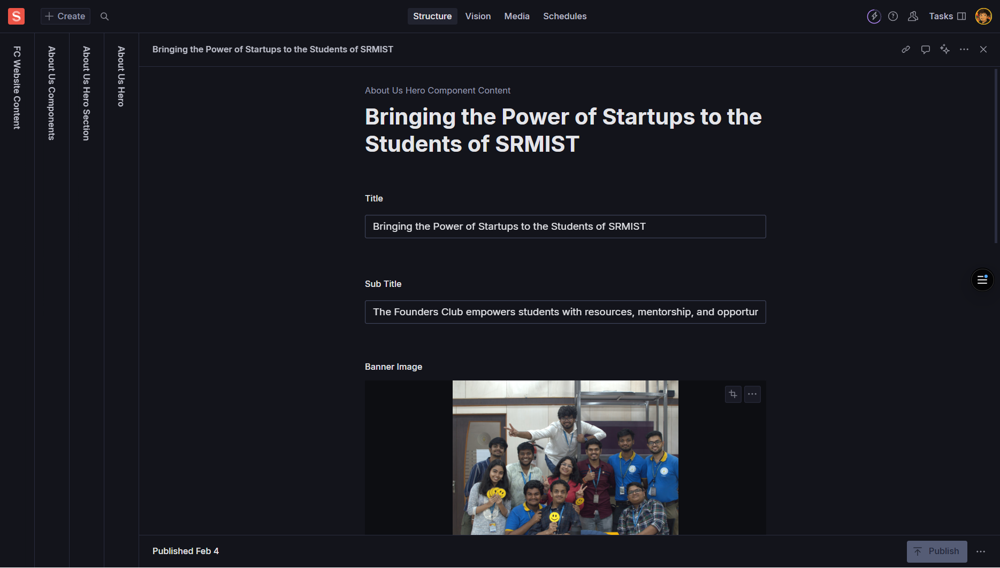
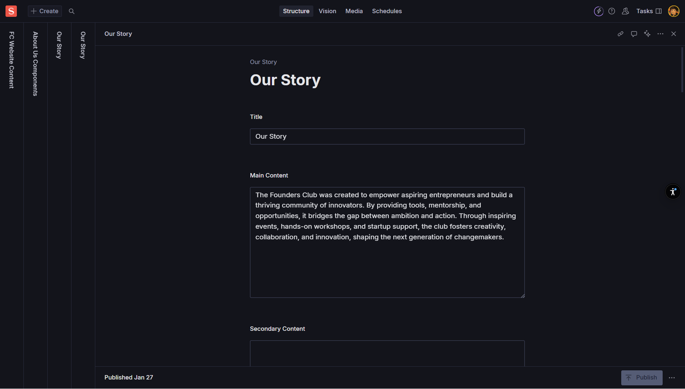
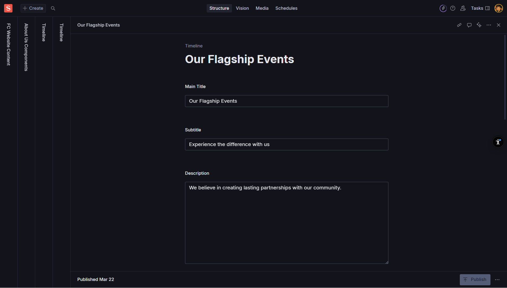
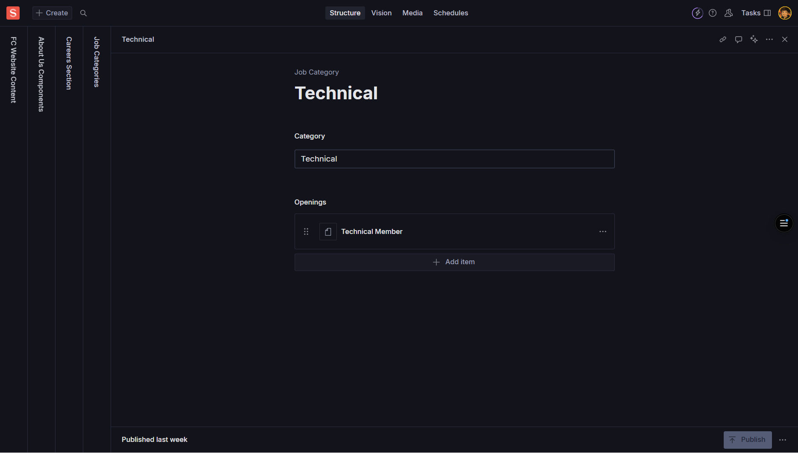

import { Card, CardGrid, Aside, Icon, LinkCard } from '@astrojs/starlight/components';
import { Quiz, QuizOption, List } from 'starlight-videos/components';

<Aside type="tip" icon="star">
  <b>For Content & Creative Teams</b>  
  This guide covers all About page components in order: About Us → Our Story → Timeline → Careers
</Aside>

## Overview

The About page tells the story of Founders Club - who we are, our mission, our journey, and opportunities to join our team. This guide walks you through each component section with clear instructions for content editing.

<CardGrid>
  <Card title="4 Main Components" icon="list-format">
    About Us Hero, Our Story, Timeline, and Careers sections
  </Card>
  <Card title="Storytelling Focus" icon="open-book">
    Components designed to share your organization's narrative and culture
  </Card>
  <Card title="Required Fields" icon="warning">
    Several components have required fields that must be completed before publishing
  </Card>
</CardGrid>

---

## About Us Component

### What is the About Us Section?

The About Us component powers the main About page hero section, including the headline, banner image, mission statement, values, and call-to-action cards.

### Hero Section Fields

<CardGrid>
  <Card title="Title" icon="pencil">
    **Required** - Main headline for the About page hero
     *Example: "Building India's Premier Startup Ecosystem"*
  </Card>
  <Card title="Sub Title" icon="document">
    **Required** - Supporting line under the headline
     *Example: "Empowering entrepreneurs to transform ideas into successful ventures"*
  </Card>
  <Card title="Banner Image" icon="seti:image">
    **Required** - Large hero image (1600px+ width recommended)
     *Always add descriptive Alt Text for accessibility*
  </Card>
  <Card title="Our Mission" icon="star">
    **Required** - Concise mission statement
     *Example: "To create a thriving community where entrepreneurs can learn, connect, and grow together"*
     *Keep to one impactful sentence*
  </Card>
</CardGrid>

### Secondary Section Fields

<CardGrid>
  <Card title="Secondary Heading" icon="pencil">
    **Required** - Second headline below the hero
     *Example: "What We Stand For"*
  </Card>
  <Card title="Secondary Sub Heading" icon="document">
    **Required** - Supporting line under secondary heading
     *Example: "Our core values guide everything we do"*
  </Card>
</CardGrid>

### Our Values Section

<Aside type="caution" icon="warning">
  **Important**: Our Values must have exactly 3 items. The Studio enforces "3 only! Not more, not less."
</Aside>

Each value entry includes:

<CardGrid>
  <Card title="Icon" icon="seti:image">
    **Required** - Icon identifier or name
     *Use consistent set: simple names, emojis, or icon identifiers*
     *Examples: "innovation", "community", "growth" or "🚀", "🤝", "📈"*
  </Card>
  <Card title="Title" icon="pencil">
    **Required** - Value title (3-5 words)
     *Examples: "Innovation First", "Community Driven", "Growth Mindset"*
  </Card>
  <Card title="Description" icon="document">
    **Required** - One sentence explaining the value
     *Example: "We embrace cutting-edge ideas and creative solutions to solve complex challenges."*
  </Card>
</CardGrid>

### About Us CTA Component

The CTA component is an array that supports multiple call-to-action cards:

<CardGrid>
  <Card title="Title" icon="pencil">
    **Required** - The CTA card's title
     *Example: "Join Our Community"*
  </Card>
  <Card title="CTA Banner Image" icon="seti:image">
    **Required** - Visual for the CTA card
     *Add descriptive Alt Text when prompted*
  </Card>
  <Card title="Sub Title" icon="document">
    **Required** - Short supporting text
     *Example: "Connect with like-minded entrepreneurs and grow your startup"*
  </Card>
</CardGrid>

### How to Edit the About Us Component

1. **Navigate** to "About Us Hero Component Content" in Sanity Studio
2. **Fill** Title and Sub Title fields (both required)
3. **Upload** Banner Image with descriptive Alt Text
4. **Add** Our Mission statement (keep concise and impactful)
5. **Set** Secondary Heading and Secondary Sub Heading
6. **Add exactly 3 Our Values entries**:
   - Choose consistent Icon style
   - Write clear Title (3-5 words)
   - Provide one-sentence Description
7. **Add CTA cards** (you can add multiple):
   - Set engaging Title
   - Upload CTA Banner Image with Alt Text
   - Write compelling Sub Title
8. **Publish** your changes

<Aside type="tip" icon="approve-check">
  **Content Tip**: Your mission statement should be memorable and actionable. Focus on what you do for your community rather than what you are.
</Aside>

---

## Our Story Component

### What is the Our Story Section?

The Our Story component is a storytelling section that covers your organization's history, culture, and journey. It includes options for multiple content sections and image galleries.

### Main Story Fields

<CardGrid>
  <Card title="Title" icon="pencil">
    **Required** - Section headline
     *Example: "Our Story" or "How We Started"*
  </Card>
  <Card title="Main Content" icon="open-book">
    **Required** - The primary narrative
     *Use short paragraphs (2-4 sentences) for better readability*
     *Tell your founding story, key milestones, or organizational evolution*
  </Card>
  <Card title="Secondary Content" icon="document">
    **Optional** - Additional detail if needed
     *Use for supplementary information or extended narrative*
  </Card>
</CardGrid>

### Workplace/Culture Section

<CardGrid>
  <Card title="Workplace Title" icon="pencil">
    **Optional** - Headline for workplace/culture sub-section
     *Example: "Our Culture" or "Working at Founders Club"*
  </Card>
  <Card title="Workplace Content" icon="document">
    **Optional** - Primary text for workplace section
     *Describe your team culture, work environment, or values in action*
  </Card>
  <Card title="Workplace Secondary Content" icon="open-book">
    **Optional** - Supporting text for workplace section
     *Additional details about team dynamics, benefits, or culture highlights*
  </Card>
</CardGrid>

### Image Gallery

<CardGrid>
  <Card title="Images Object" icon="seti:image">
    **Optional** - Up to 6 images showcasing your story
     **Image 1 through Image 6** - Each supports hotspot functionality
     **Alternative Text** - Describe what's shown in each image
  </Card>
</CardGrid>

Each image field includes:
- **Image upload** with hotspot/crop functionality
- **Alternative Text field** for accessibility
- **Optional usage** - use only the images you need

### How to Edit Our Story

1. **Open** "Our Story" in Sanity Studio
2. **Set** the Title field
3. **Write** Main Content (keep paragraphs short and engaging)
4. **Add** Secondary Content if you need additional narrative
5. **Fill** Workplace fields if showcasing culture:
   - Workplace Title
   - Workplace Content  
   - Workplace Secondary Content
6. **Upload** up to 6 images with descriptive Alt Text
7. **Publish** your changes

<Aside type="note" icon="information">
  **Content Strategy**: Use storytelling principles - start with your founding moment, highlight key challenges overcome, and showcase what makes your organization unique.
</Aside>

---

## Timeline Component

### What is the Timeline Section?

The Timeline component displays a chronological sequence of your organization's milestones, achievements, and key moments. It includes optional intro content and action buttons.

### Header Section Fields

<CardGrid>
  <Card title="Main Title" icon="pencil">
    **Optional** - Section title
     *Example: "Our Journey" or "Key Milestones"*
  </Card>
  <Card title="Subtitle" icon="document">
    **Optional** - Short supporting line
     *Example: "From idea to India's leading startup community"*
  </Card>
  <Card title="Description" icon="open-book">
    **Optional** - Brief intro paragraph for the timeline
     *Set context for the milestones that follow*
  </Card>
</CardGrid>

### Action Buttons

<CardGrid>
  <Card title="Primary Button" icon="right-arrow">
    **Primary Button Text** (optional) - Main CTA label
     **Primary Button Link** (optional) - Full URL or site path
     *Example: Text: "Join Us Today", Link: "/membership"*
  </Card>
  <Card title="Secondary Button" icon="external">
    **Secondary Button Text** (optional) - Secondary action label
     **Secondary Button Link** (optional) - Full URL or site path
     **Show Secondary Button** (boolean) - Toggle visibility
     *Example: Text: "Learn More", Link: "/about"*
  </Card>
</CardGrid>

### Timeline Items

Each timeline item includes:

<CardGrid>
  <Card title="Title" icon="pencil">
    **Required** - Milestone title
     *Examples: "Company Founded", "First Event", "100 Members Milestone"*
     *Keep clear and concise*
  </Card>
  <Card title="Description" icon="document">
    **Required** - Short explanation of the milestone
     *Use 1-2 sentences to describe the significance*
     *Example: "Launched our first networking event with 25 passionate entrepreneurs."*
  </Card>
  <Card title="Image" icon="seti:image">
    **Optional** - Visual for the milestone
     **Alternative Text** - Describe the image content for accessibility
     *Use photos from the actual events or relevant graphics*
  </Card>
</CardGrid>

### How to Edit the Timeline

1. **Open** "Timeline" in Sanity Studio
2. **Add** Title, Subtitle, and Description if desired
3. **Set up action buttons**:
   - Add Primary Button Text and Link if needed
   - Add Secondary Button Text and Link if needed
   - Toggle "Show Secondary Button" appropriately
4. **Add timeline items**:
   - Write clear, concise Title for each milestone
   - Provide 1-2 sentence Description
   - Upload optional Image with Alt Text
5. **Arrange items** in chronological order
6. **Publish** your changes

<Aside type="caution" icon="warning">
  **Button Links**: If you add button text, make sure to also provide the corresponding link. Buttons without links may not function properly on the live site.
</Aside>

---

## Careers Component

### What is the Careers Section?

The Careers component organizes job openings by category (departments/teams) with individual job listings that include titles, locations, and application links.

### Job Category Structure

<CardGrid>
  <Card title="Category" icon="setting">
    **Required** - Name of the job category
     *Examples: "Engineering", "Design", "Marketing", "Operations"*
     *Keep names simple and consistent across documents*
  </Card>
  <Card title="Openings Array" icon="list-format">
    **Required** - Individual job listings within the category
     *Each opening contains job details and application link*
  </Card>
</CardGrid>

### Individual Job Opening Fields

Each opening in the array includes:

<CardGrid>
  <Card title="Job Title" icon="pencil">
    **Required** - The role name
     *Examples: "Frontend Engineer", "UX Designer", "Content Marketing Manager"*
     *Use standard industry job titles when possible*
  </Card>
  <Card title="Location" icon="setting">
    **Required** - Work location details
     *Examples: "Mumbai, India", "Remote", "Hybrid - Bangalore", "On-site - Delhi"*
     *Be specific about location requirements*
  </Card>
  <Card title="Link" icon="external">
    **Required** - Full application URL
     *Must start with http:// or https://*
     *Example: "https://careers.company.com/jobs/frontend-engineer"*
     *Studio will warn if URL format is invalid*
  </Card>
</CardGrid>

### How to Edit Careers

1. **Create Job Category documents** (one per department):
   - Go to "Job Category" in Sanity Studio
   - Create new document for each category (e.g., "Engineering")
2. **For each category**:
   - Set the Category name (e.g., "Engineering")
   - Add job openings:
     - Fill Job Title
     - Specify Location
     - Add full application Link (with https://)
3. **Test all links** to ensure they work correctly
4. **Publish each category** document
5. **Repeat** for additional job categories

### Managing Multiple Categories

<CardGrid>
  <Card title="Organization" icon="setting">
    Create separate Job Category documents for each department
     *Examples: Engineering, Design, Marketing, Operations, Sales*
  </Card>
  <Card title="Consistency" icon="approve-check">
    Use consistent category naming across all documents
     *Maintain the same capitalization and format*
  </Card>
  <Card title="Updates" icon="pencil">
    Regularly update job listings as positions open and close
     *Remove filled positions and add new openings*
  </Card>
</CardGrid>

<Aside type="tip" icon="star">
  **Link Testing**: Always test your job application links after adding them. Broken links create a poor candidate experience and may result in missed applications.
</Aside>

---

## Content Guidelines and Best Practices

### Accessibility Standards

<CardGrid>
  <Card title="Alt Text for Images" icon="seti:image">
    Provide descriptive Alt Text that explains what the image shows
     *Example: "Team photo from Founders Club annual conference 2024"*
     *Avoid generic terms like "image" or "photo"*
  </Card>
  <Card title="Link Accessibility" icon="external">
    Use descriptive link text and test all external URLs
     *Ensure job application links are accessible and functional*
     *Include https:// for all external links*
  </Card>
</CardGrid>

### Content Quality Standards

<CardGrid>
  <Card title="Brevity and Clarity" icon="pencil">
    **Story Content**: Use short paragraphs (2-4 sentences)
     **Timeline Items**: Keep descriptions to 1-2 sentences
     **Mission Statements**: Aim for one impactful sentence
  </Card>
  <Card title="Consistency" icon="approve-check">
    **Tone**: Maintain consistent voice across all sections
     **Formatting**: Use consistent capitalization and punctuation
     **Category Names**: Keep job categories consistently named
  </Card>
  <Card title="Storytelling" icon="open-book">
    **Our Story**: Focus on key moments and challenges overcome
     **Timeline**: Highlight genuine milestones and achievements
     **Values**: Connect abstract concepts to concrete examples
  </Card>
</CardGrid>

### Technical Requirements

<CardGrid>
  <Card title="Required Fields" icon="warning">
    **About Us**: All main fields are required before publishing
     **Our Values**: Must have exactly 3 items (enforced by Studio)
     **Job Openings**: Title, Location, and Link are all required
  </Card>
  <Card title="Image Specifications" icon="seti:image">
    **Banner Images**: 1600px+ width recommended
     **Story Images**: Up to 6 images with hotspot support
     **Timeline Images**: Optional but enhance storytelling when used
  </Card>
  <Card title="Link Validation" icon="external">
    **Job Links**: Must include http:// or https://
     **Button Links**: Provide links when button text is present
     **Testing**: Verify all links work before publishing
  </Card>
</CardGrid>

---

## Test Your Knowledge

<Quiz title="How many values are required in the Our Values section?">
  <QuizOption>2 values</QuizOption>
  <QuizOption correct>Exactly 3 values</QuizOption>
  <QuizOption>Up to 5 values</QuizOption>
</Quiz>

<Quiz title="What's the recommended approach for Our Story content paragraphs?">
  <QuizOption>One long paragraph with all details</QuizOption>
  <QuizOption correct>Short paragraphs with 2-4 sentences each</QuizOption>
  <QuizOption>Bullet points only</QuizOption>
</Quiz>

<Quiz title="What happens if you add Secondary Button text but leave 'Show Secondary Button' turned off?">
  <QuizOption>The button shows with default styling</QuizOption>
  <QuizOption correct>The button won't render on the site</QuizOption>
  <QuizOption>An error message appears</QuizOption>
</Quiz>

<Quiz title="What's required for job application links in the Careers section?">
  <QuizOption>Just the domain name</QuizOption>
  <QuizOption correct>Full URL starting with http:// or https://</QuizOption>
  <QuizOption>Only internal site paths</QuizOption>
</Quiz>

<Quiz title="How should you organize job openings in the Careers section?">
  <QuizOption>All jobs in one document</QuizOption>
  <QuizOption correct>Separate Job Category documents for each department</QuizOption>
  <QuizOption>One document per job opening</QuizOption>
</Quiz>

---

## Quick Reference

### Component Requirements Summary

<CardGrid stagger>
  <Card title="About Us" icon="pencil">
    **Required**: Title, Sub Title, Banner Image, Mission, Secondary Heading, Secondary Sub Heading, 3 Values, CTA components
     **Optional**: Additional CTA cards
  </Card>
  <Card title="Our Story" icon="open-book">
    **Required**: Title, Main Content
     **Optional**: Secondary Content, Workplace sections, up to 6 images
  </Card>
  <Card title="Timeline" icon="seti:clock">
    **Required**: Timeline Items (Title, Description per item)
     **Optional**: Headers, buttons, item images
  </Card>
  <Card title="Careers" icon="setting">
    **Required**: Category name, Job openings (Title, Location, Link each)
     **Optional**: None (all fields within openings are required)
  </Card>
</CardGrid>

### Content Length Guidelines
- **Mission Statement**: 1 impactful sentence
- **Value Descriptions**: 1 sentence each
- **Story Paragraphs**: 2-4 sentences
- **Timeline Descriptions**: 1-2 sentences
- **Job Titles**: Standard industry terms

<Aside type="tip" icon="star">
  **Publishing Reminder**: All required fields must be completed before you can publish. The Studio will highlight any missing required fields in red.
</Aside>
