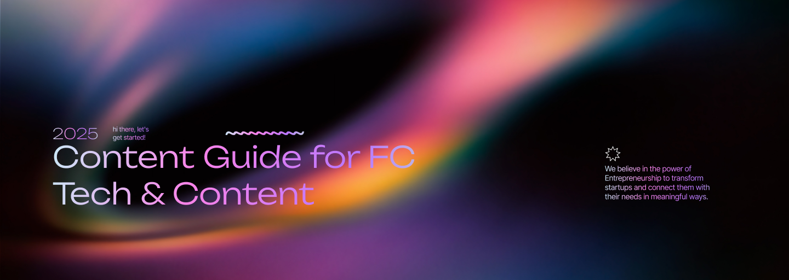

import { Card, CardGrid, Aside, Icon, LinkCard } from '@astrojs/starlight/components';
import { Quiz, QuizOption, List } from 'starlight-videos/components';

<Aside type="tip" icon="star">
  <b>For Content & Creative Teams</b>  
  This guide covers creating high-converting contact forms that capture qualified leads and route them effectively to your team
</Aside>

<List title="Before you start" variant="caution">
- Define your lead routing strategy (who handles sales, partnerships, press inquiries)
- Prepare email addresses for different inquiry types (sales@, partnerships@, support@)
- Review your Privacy Policy and ensure it covers contact form data usage
- Have your CRM or notification system (Slack, email) ready for integration testing
</List>

<List title="What you'll find in this guide" variant="note">
- Complete contact form configuration for lead capture and routing
- Form field optimization for qualification without friction
- Lead routing strategies and CRM integration best practices
- Compliance requirements including consent management and privacy
- Conversion optimization techniques for founder-operator teams
- Accessibility standards and SEO optimization for contact pages
</List>

## Overview

Contact pages are critical conversion surfaces that capture high-intent prospects, partners, and candidates. A well-optimized contact component routes inquiries efficiently, reduces response time, and feeds your growth flywheel through CRM integration and automated follow-ups.

<CardGrid>
  <Card title="High-Intent Surface" icon="star">
    Contact pages are top conversion paths for prospects, partners, and talent acquisition
  </Card>
  <Card title="Speed-to-Lead" icon="seti:clock">
    Clear routing and instant alerts reduce response time and improve close rates
  </Card>
  <Card title="Signal Capture" icon="setting">
    Collects source, campaign, and qualification data critical for lead prioritization
  </Card>
</CardGrid>

---

## Why Contact Pages Matter for Founders

### Strategic Business Impact

<CardGrid>
  <Card title="Conversion Optimization" icon="right-arrow">
    **High-Intent Traffic**: Contact forms capture visitors ready to engage
     **Speed-to-Lead**: Faster response times directly correlate with higher close rates
     **Qualification**: Capture company size, budget, and timeline for prioritization
  </Card>
  <Card title="Operational Efficiency" icon="setting">
    **Automated Routing**: Direct inquiries to the right team member instantly
     **CRM Integration**: Feed leads directly into your sales and marketing automation
     **Source Attribution**: Track which channels produce the highest-value conversations
  </Card>
  <Card title="Credibility Building" icon="star">
    **Professional Presence**: Set clear expectations and response SLAs
     **Trust Signals**: Show who you're positioned to help and how
     **Social Proof**: Include testimonials or logos near the form
  </Card>
  <Card title="Growth Flywheel" icon="external">
    **Lead Nurturing**: Feed email lists and onboarding sequences
     **Partnership Pipeline**: Streamline BD and collaboration inquiries
     **Content Source**: Turn inquiries into case studies and testimonials
  </Card>
</CardGrid>

---

## Contact Component Structure

### Header and Introduction

<CardGrid>
  <Card title="Title" icon="pencil">
    **Required** - Page or section headline
     *Examples*: "Get in Touch", "Let's Connect", "Contact Our Team"
     *Keep clear and action-oriented*
  </Card>
  <Card title="Sub Title / Intro" icon="document">
    **Optional** - Sets expectations and context
     *Example*: "We respond to all inquiries within 1 business day. Let us know how we can help."*
     *Include response SLA and who should contact you*
  </Card>
  <Card title="Cover Image / Icon" icon="seti:image">
    **Optional** - Visual element for the contact section
     *Always add Alt Text if using an image*
     *Can be team photo, office image, or branded graphic*
  </Card>
</CardGrid>

---

## Form Field Configuration

### Essential Form Fields

<CardGrid>
  <Card title="Full Name" icon="pencil">
    **Required** - Complete name of the person contacting you
     *Single field is usually sufficient*
     *Avoid splitting into first/last name unless CRM requires it*
  </Card>
  <Card title="Work Email" icon="email">
    **Required** - Professional email address
     *Use email validation to ensure format correctness*
     *Consider rejecting disposable email domains for quality*
  </Card>
  <Card title="Reason/Topic" icon="setting">
    **Required** - Purpose of their inquiry
     *Options*: "Sales", "Partnerships", "Media/Press", "Careers", "Support", "Other"
     *Keep to 4-6 clear options to avoid choice paralysis*
  </Card>
  <Card title="Message" icon="open-book">
    **Required** - Main inquiry content
     *Provide helpful prompts: "Tell us about your goals, timeline, and any relevant links"*
     *Rich text or plain text depending on your needs*
  </Card>
</CardGrid>

### Qualification Fields

<CardGrid>
  <Card title="Company" icon="setting">
    **Recommended** - Organization name
     *Helps with lead qualification and routing*
     *Optional but valuable for B2B contexts*
  </Card>
  <Card title="Role/Title" icon="document">
    **Optional** - Job title or function
     *Useful for understanding decision-making authority*
     *Examples: "CEO", "Head of Marketing", "VP Sales"*
  </Card>
  <Card title="Website/LinkedIn" icon="external">
    **Optional** - Professional profile or company URL
     *Helps with lead research and qualification*
     *Accept LinkedIn profiles, company websites, or portfolios*
  </Card>
</CardGrid>

### Advanced Qualification

<CardGrid>
  <Card title="Budget Range" icon="setting">
    **Optional** - For sales-focused forms
     *Select options*: "Under $10K", "$10K-$50K", "$50K-$100K", "$100K+"
     *Adjust ranges based on your pricing model*
  </Card>
  <Card title="Timeline/Urgency" icon="seti:clock">
    **Optional** - Project timeline
     *Options*: "ASAP", "Within 1 month", "1-3 months", "3+ months", "Just researching"
     *Helps prioritize follow-up activities*
  </Card>
  <Card title="Phone" icon="phone">
    **Optional** - Contact number
     *Include country code instructions*
     *Only add if you plan to make phone calls*
  </Card>
  <Card title="Country/Region" icon="setting">
    **Optional** - Geographic location
     *Useful for timezone coordination and local regulations*
     *Can help with market analysis and expansion planning*
  </Card>
</CardGrid>

---

## Consent and Privacy Management

### Privacy Compliance

<CardGrid>
  <Card title="Consent Checkbox" icon="approve-check">
    **Recommended** - Required for legal compliance
     **Label**: "I agree to the Privacy Policy and consent to be contacted"
     **Privacy Policy Link**: Must link to your current privacy policy
     *Required for GDPR and other privacy regulations*
  </Card>
  <Card title="Marketing Opt-in" icon="email">
    **Optional** - Separate consent for marketing communications
     **Boolean Checkbox**: Separate from general contact consent
     **Label**: "Yes, I'd like to receive updates about events and resources"
     *Keep separate from required consent for contact*
  </Card>
</CardGrid>

### Data Handling

<CardGrid>
  <Card title="Data Retention" icon="seti:clock">
    **Policy** - Define how long you retain form submissions
     *Document retention periods in your privacy policy*
     *Implement regular purging for inactive leads*
  </Card>
  <Card title="Security Standards" icon="setting">
    **Guidelines** - Protect sensitive information
     *Never ask for passwords or secrets in contact forms*
     *Avoid file attachments unless absolutely necessary*
     *Use HTTPS for all form submissions*
  </Card>
</CardGrid>

---

## Lead Routing and Automation

### Notification Configuration

<CardGrid>
  <Card title="Recipient Emails" icon="email">
    **Required** - Array of email addresses for notifications
     *Use role-based addresses: sales@, partnerships@, support@*
     *Avoid single-person bottlenecks that create delays*
  </Card>
  <Card title="Routing Rules" icon="setting">
    **Optional** - Conditional routing based on inquiry type
     *If Reason="Sales" → route to sales@company.com*
     *If Reason="Partnerships" → route to partnerships@company.com*
     *Always include a default fallback route*
  </Card>
  <Card title="Slack/Webhook" icon="external">
    **Optional** - Real-time notifications
     *Send alerts to "#inbound" or "#leads" channel*
     *Include key fields: Reason, Company, Email, Source*
     *Enable faster response times for high-priority leads*
  </Card>
</CardGrid>

### Response Automation

<CardGrid>
  <Card title="Auto-Responder" icon="email">
    **Optional** - Immediate confirmation email
     **Subject**: "Thanks for contacting [Company Name]"
     **Body**: Set expectations, include helpful links
     *Consider adding FAQ links or calendar booking for sales inquiries*
  </Card>
  <Card title="Success Message" icon="approve-check">
    **Required** - Inline confirmation after submission
     *Example*: "Thanks! We'll reply within 1 business day."
     *Set specific SLA and honor it consistently*
  </Card>
  <Card title="Success Redirect" icon="external">
    **Optional** - Redirect to thank you page
     *URL*: "/thank-you" or "/contact-success"
     *Overrides inline success message if set*
     *Good opportunity for additional CTAs or social proof*
  </Card>
</CardGrid>

---

## Contact Form Variants

### Specialized Form Types

<CardGrid stagger>
  <Card title="General Contact" icon="email">
    **Use Case**: Multi-purpose inquiry form
     **Fields**: Name, Email, Reason/Topic, Message
     **Routing**: Based on Reason selection
     **Best For**: Corporate sites with diverse inquiry types
  </Card>
  <Card title="Sales/Demo Request" icon="right-arrow">
    **Use Case**: High-intent prospect capture
     **Fields**: Name, Work Email, Company, Message
     **Routing**: Direct to sales team
     **Best For**: SaaS products, B2B services
  </Card>
  <Card title="Partnerships/BD" icon="external">
    **Use Case**: Business development inquiries
     **Fields**: Name, Email, Company, Website, Message
     **Emphasis**: Mutual value and audience reach
     **Best For**: Platform businesses, content partnerships
  </Card>
  <Card title="Media/Press" icon="open-book">
    **Use Case**: Journalist and media inquiries
     **Fields**: Name, Email, Outlet, Deadline, Message
     **Special**: Faster SLA note (same day response)
     **Best For**: PR-active companies, thought leadership
  </Card>
</CardGrid>

---

## CRM Integration Strategy

### Lead Data Mapping

<CardGrid>
  <Card title="Contact Information" icon="approve-check-circle">
    **Name** → contact.name (CRM field)
     **Work Email** → contact.email
     **Company** → account.name
     **Phone** → contact.phone
     **Role** → contact.job_title
  </Card>
  <Card title="Qualification Data" icon="setting">
    **Reason** → lead_type or lifecycle_stage
     **Budget Range** → deal.budget
     **Timeline** → deal.close_date_estimate
     **Source** → contact.original_source
  </Card>
  <Card title="Activity Tracking" icon="list-format">
    **Message** → latest_activity_note
     **UTM Data** → original_source fields
     **Form Submission** → contact_creation_date
     **Page Source** → landing_page_url
  </Card>
</CardGrid>

### Source Attribution

<CardGrid>
  <Card title="UTM Parameter Capture" icon="setting">
    **Hidden Fields** that capture marketing data
     *utm_source, utm_medium, utm_campaign*
     *utm_term, utm_content*
     *Helps track which channels produce best leads*
  </Card>
  <Card title="Session Data" icon="list-format">
    **Additional Tracking** for attribution
     *referrer (where they came from)*
     *landing_page (first page visited)*
     *first_touch and last_touch timestamps*
  </Card>
</CardGrid>

---

## Conversion Optimization

### Above-the-Fold Clarity

<CardGrid>
  <Card title="Value Proposition" icon="star">
    **Clear Statement**: Who should contact you and why
     *Example*: "Get expert guidance on scaling your B2B SaaS startup"
     **Social Proof**: Add 1-2 credible logos or short testimonial near form
  </Card>
  <Card title="SLA Setting" icon="seti:clock">
    **Response Time**: Promise realistic response time
     *"We respond within 1 business day during weekdays"*
     **Business Hours**: Include if relevant for urgent inquiries
  </Card>
</CardGrid>

### Friction vs. Qualification Balance

<CardGrid>
  <Card title="Progressive Disclosure" icon="setting">
    **Start Short**: Name, Work Email, Reason, Message
     **Add Conditionally**: Company field only if needed for triage
     **Optional Fields**: Budget, timeline for qualification without friction
  </Card>
  <Card title="CTA Alignment" icon="right-arrow">
    **Match Business Goal**: Button text aligned with primary objective
     *"Book a Demo", "Request Access", "Start Partnership Discussion"*
     **A/B Testing**: Test intro copy, field counts, CTA labels
  </Card>
</CardGrid>

---

## How to Configure Contact Forms

### Step-by-Step Setup

1. **Open Contact Component** in Sanity Studio
2. **Configure Header**:
   - Set Title and introductory copy
   - Add Cover Image with Alt Text if desired
   - Include response time expectations
3. **Design Form Fields**:
   - Add required fields: Name, Work Email, Reason, Message
   - Include optional qualification fields as needed
   - Configure Reason/Topic dropdown options
4. **Set Up Privacy and Consent**:
   - Add consent checkbox with Privacy Policy link
   - Include optional marketing opt-in
   - Ensure compliance with applicable regulations
5. **Configure Notifications**:
   - Set recipient email addresses
   - Add Slack webhook or other notification systems
   - Configure routing rules for different inquiry types
6. **Set Success Handling**:
   - Write success message with clear SLA
   - Configure thank you page redirect if needed
   - Set up auto-responder email if desired
7. **Add SEO Elements**:
   - Complete meta title and description
   - Set OG image for social sharing
   - Ensure page is indexable
8. **Test Integration**:
   - Submit test form from live site
   - Verify all notifications and routing work
   - Test CRM integration and data mapping

---

## Security and Spam Prevention

### Protection Measures

<CardGrid>
  <Card title="Captcha Integration" icon="setting">
    **reCAPTCHA/hCaptcha**: Prevent automated spam
     *Coordinate with development team for implementation*
     *Choose invisible captcha for better user experience*
  </Card>
  <Card title="Rate Limiting" icon="seti:clock">
    **Submission Limits**: Prevent spam bursts
     *Limit submissions per IP address per time period*
     *Coordinate with development team for setup*
  </Card>
  <Card title="Honeypot Fields" icon="setting">
    **Hidden Traps**: Catch basic spam bots
     *Hidden fields that humans can't see but bots will fill*
     *Reject submissions with honeypot data*
  </Card>
</CardGrid>

---

## Pre-Publish Checklist

<List title="Before Publishing" variant="caution">
- Title and intro copy clearly set expectations and target audience
- Required fields configured: Name, Work Email, Reason/Topic, Message
- Consent checkbox present with accurate Privacy Policy link
- Notification recipients set up with role-based email addresses
- Routing rules tested for each Reason/Topic option
- Success message or thank you redirect configured with realistic SLA
- SEO fields completed: meta title, description, indexability set
- Test submission completed on staging/production environment
- All notification systems (email, Slack, CRM) verified working
- Spam protection measures enabled (captcha, rate limiting, honeypot)
</List>

---

## Test Your Knowledge

<Quiz title="What's the recommended number of Reason/Topic options?">
  <QuizOption>2-3 options</QuizOption>
  <QuizOption correct>4-6 options</QuizOption>
  <QuizOption>10+ options</QuizOption>
</Quiz>

<Quiz title="Which email addresses should you use for notifications?">
  <QuizOption>Personal email addresses of team members</QuizOption>
  <QuizOption correct>Role-based addresses like sales@ and partnerships@</QuizOption>
  <QuizOption>Only the founder's email</QuizOption>
</Quiz>

<Quiz title="What should you avoid asking for in contact forms?">
  <QuizOption>Company name and website</QuizOption>
  <QuizOption correct>Passwords or secret information</QuizOption>
  <QuizOption>Budget range and timeline</QuizOption>
</Quiz>

<Quiz title="Why are separate consent checkboxes important?">
  <QuizOption>They look more professional</QuizOption>
  <QuizOption correct>Legal compliance for privacy regulations like GDPR</QuizOption>
  <QuizOption>They increase conversion rates</QuizOption>
</Quiz>

<Quiz title="What's the benefit of UTM parameter capture?">
  <QuizOption>It makes forms load faster</QuizOption>
  <QuizOption correct>It tracks which channels produce the best leads</QuizOption>
  <QuizOption>It prevents spam submissions</QuizOption>
</Quiz>

---

## Content Guidelines and Best Practices

### Accessibility Standards

<CardGrid>
  <Card title="Form Accessibility" icon="approve-check">
    **Labels**: Every input needs visible labels, not just placeholders
     **Error Messages**: Provide clear, inline error messages with ARIA attributes
     **Keyboard Navigation**: Ensure full keyboard accessibility and visible focus states
  </Card>
  <Card title="Visual Design" icon="seti:image">
    **Color Contrast**: Sufficient contrast for text and buttons
     **Alt Text**: Add for decorative images; mark as decorative if non-essential
     **Responsive**: Ensure forms work on all device sizes
  </Card>
</CardGrid>

### SEO Optimization

<CardGrid>
  <Card title="Page Structure" icon="setting">
    **Page Title**: Include brand and "Contact" (e.g., "Contact | Founders Club")
     **Structured Data**: Consider ContactPage or Organization contactPoint JSON-LD
     **Meta Description**: Describe what visitors can expect from contacting you
  </Card>
  <Card title="Content Quality" icon="star">
    **Clear Value Prop**: Explain who should contact you and why
     **Response Expectations**: Set clear SLAs and honor them
     **Professional Tone**: Maintain consistent brand voice throughout
  </Card>
</CardGrid>

---

## Quick Reference

### Essential Fields
- ✅ **Full Name** - Required for personalization
- ✅ **Work Email** - Required for response and CRM
- ✅ **Reason/Topic** - Required for routing (4-6 options)
- ✅ **Message** - Required main inquiry content

### Recommended Fields
- ⚠️ **Company** - Helpful for B2B qualification
- ⚠️ **Consent Checkbox** - Required for GDPR compliance
- ⚠️ **Success Message** - Sets response expectations
- ⚠️ **Notification Setup** - Ensures leads reach the right team

### Form Variants by Use Case
- **General Contact**: Multi-purpose with reason-based routing
- **Sales/Demo**: High-intent prospect capture with qualification
- **Partnerships**: BD inquiries emphasizing mutual value
- **Media/Press**: Journalist inquiries with faster response SLA

### CRM Integration Essentials
- **Contact Data**: Name, email, company, role mapping
- **Qualification**: Budget, timeline, source attribution
- **Activity Tracking**: Message content, submission metadata
- **Source Attribution**: UTM parameters, referrer data

<List title="What did you learn?" variant="success">
- How to design high-converting contact forms that capture qualified leads
- Lead routing strategies and notification systems for faster response times
- Privacy compliance requirements including consent management and data handling
- CRM integration techniques for seamless lead nurturing and attribution
- Conversion optimization tactics including friction reduction and social proof
- Security measures including spam prevention and rate limiting
- Accessibility standards and SEO optimization for professional contact pages
- Testing procedures and pre-publish checklists for reliable form functionality
</List>

<Aside type="tip" icon="star">
  **Founder Focus**: Remember that your contact form is often the first direct interaction prospects have with your team. Optimize for speed-to-lead, clear qualification, and professional presentation to maximize conversion and create a positive first impression.
</Aside>
