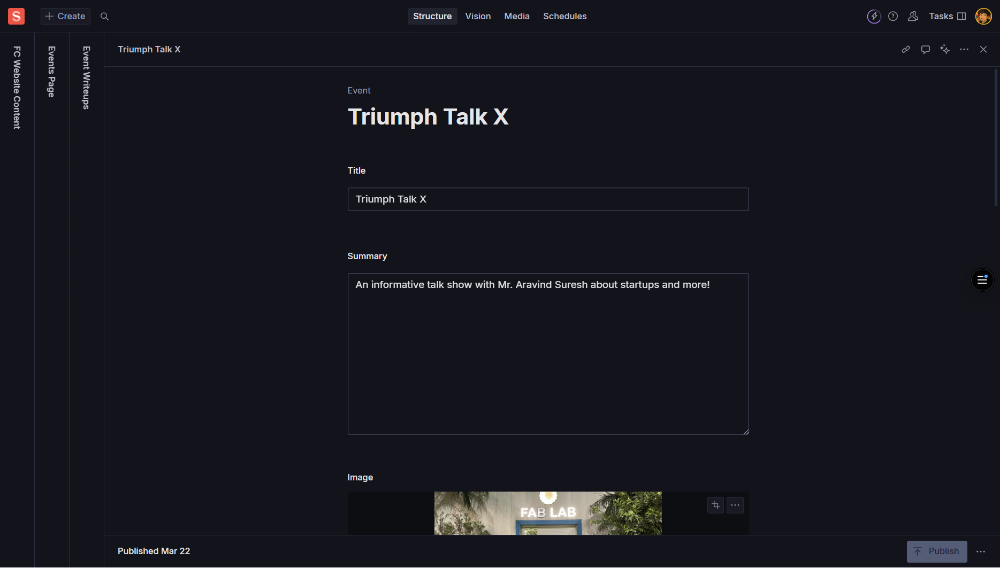

import { Card, CardGrid, Aside, Icon, LinkCard } from '@astrojs/starlight/components';
import { Quiz, QuizOption, List } from 'starlight-videos/components';

<Aside type="tip" icon="star">
  <b>For Content & Creative Teams</b>  
  This guide covers creating compelling event writeups that build credibility, attract talent, and preserve institutional knowledge
</Aside>

<List title="Before you start" variant="caution">
- [ ] Gather all event materials (photos, videos, slides, notes)
- [ ] Collect speaker information and headshots with proper permissions
- [ ] Prepare attendee metrics and outcome data for impact measurement
- [ ] Have video recordings or livestream links ready for embedding
</List>

<List title="What you'll find in this guide" variant="note">
- Complete event writeup creation from basic details to rich content
- Strategic content frameworks for founders, investors, and community building
- Speaker and agenda management with professional presentation standards
- Media integration including photos, videos, and resource links
- Templates and prompts for creating founder-grade content assets
</List>

## Overview

Event writeups transform live experiences into enduring knowledge assets that build credibility, attract talent, and strengthen your startup community. These comprehensive post-event summaries blend narrative, takeaways, speaker insights, and resources to create valuable content for founders, investors, and community members.

<CardGrid>
  <Card title="Strategic Value" icon="star">
    Build compounding credibility and attract qualified prospects through documented expertise
  </Card>
  <Card title="Knowledge Preservation" icon="open-book">
    Capture frameworks, benchmarks, and playbooks discussed by operators and founders
  </Card>
  <Card title="Content Repurposing" icon="setting">
    One event fuels newsletter posts, social content, slides, and internal resources
  </Card>
</CardGrid>

---

## Why Event Writeups Matter

### For Founders and Community Building

<CardGrid>
  <Card title="Compounding Credibility" icon="star">
    **Public Track Record**: Well-documented events become evidence of learning, traction, and thought leadership
     **Investor Updates**: Clean links for monthly/quarterly updates showing founder-market fit exploration
  </Card>
  <Card title="Qualified Lead Generation" icon="right-arrow">
    **Search Traffic**: Good writeups capture organic traffic and convert via strategic CTAs
     **Top-of-Funnel**: Attracts subscribers, applicants, and office hours bookings
  </Card>
  <Card title="Talent Attraction" icon="approve-check-circle">
    **Culture Signal**: Candidates assess your velocity and craft through event documentation
     **Team Building**: Shows expertise areas and community engagement quality
  </Card>
  <Card title="Content Multiplication" icon="external">
    **Repurposing Engine**: One event creates newsletter content, LinkedIn threads, slide decks
     **Knowledge Base**: Builds searchable library of frameworks and learnings
  </Card>
</CardGrid>

---

## Event Writeup Component

### Core Event Information

<CardGrid>
  <Card title="Title" icon="pencil">
    **Required** - Clear and outcome-focused
     *Better*: "Finding PMF in Fintech: Frameworks from Seed to Series A"
     *Avoid*: "Monthly Startup Meetup #12"
     *Lead with the outcome or framework rather than generic labels*
  </Card>
  <Card title="Slug" icon="external">
    **Required** - URL-friendly identifier
     *Auto-generated from title in most cases*
     *Example: "pmf-fintech-frameworks-seed-series-a"*
  </Card>
  <Card title="Date & Time" icon="seti:clock">
    **Required** - Event date and time
     *Use consistent timezone (local or UTC)*
     *Format: YYYY-MM-DD HH:MM*
     *Powers URL structure and canonical metadata*
  </Card>
  <Card title="Location" icon="setting">
    **Optional** - Event venue or format
     *Examples: "Mumbai, WeWork", "Online", "Hybrid - Bangalore Hub"*
     *Be specific and consistent with location formatting*
  </Card>
</CardGrid>

### Event Classification

<CardGrid>
  <Card title="Event Type" icon="setting">
    **Optional** - Format classification
     *Options*: panel, workshop, fireside, demo-day, AMA, office-hours, hackathon, pitch-practice, meetup
     *Helps with filtering and content organization*
  </Card>
  <Card title="Audience" icon="approve-check-circle">
    **Optional** - Target participant groups
     *Array*: Founders, Investors, Students, Operators, Designers, Engineers
     *Multiple selections allowed for cross-functional events*
  </Card>
  <Card title="Startup Stage" icon="list-format">
    **Optional** - Focus stage for content
     *Options*: idea, pre-seed, seed, series-a, growth
     *Helps readers find stage-appropriate content*
  </Card>
  <Card title="Host/Organizers" icon="approve-check">
    **Optional** - Event organizers
     *Array of names, teams, or organizations*
     *Can reference team member profiles if available*
  </Card>
</CardGrid>

### Visual and Media Content

<CardGrid>
  <Card title="Cover Image" icon="seti:image">
    **Optional** - Hero image for the event
     *Landscape format recommended*
     *Always add descriptive Alt Text*
     *Example Alt Text: "Panel discussion with 4 founders at Founders Club event"*
  </Card>
  <Card title="Hero Video URL" icon="seti:video">
    **Optional** - Recording or livestream link
     *YouTube, Vimeo, or CDN URLs*
     *Takes priority over cover image in some themes*
     *Include captions/subtitles for accessibility*
  </Card>
  <Card title="Summary/Excerpt" icon="document">
    **Optional** - Brief overview (150-200 characters)
     *1-2 sentences focused on audience and value*
     *Used in listings, social cards, and SEO*
     *Example: "Learn 3 frameworks for B2B SaaS pricing from founders who raised $50M+"*
  </Card>
</CardGrid>

---

## Speaker and Agenda Management

### Speaker Profiles

<LinkCard
  title="Author Component Reference"
  href="/guides/fc/studio/components/author"
  description="Use standardized author profiles for consistent speaker presentation, headshots, and social links across your site."
/>

Each speaker entry includes:

<CardGrid>
  <Card title="Basic Information" icon="pencil">
    **Name** (required) - Full name
     **Role** (optional) - Job title
     **Organization** (optional) - Company or affiliation
     *Example: "Priya Sharma, CEO, TechStart Solutions"*
  </Card>
  <Card title="Bio and Image" icon="seti:image">
    **Bio** (optional) - Short professional summary
     **Headshot** (optional) - Professional photo with Alt Text
     *Portrait or square format preferred*
     *Alt Text example: "Portrait of John Doe, CTO at StartupCorp"*
  </Card>
  <Card title="Social Links" icon="external">
    **Array** of social media and professional profiles
     **Label** - Platform name (LinkedIn, Twitter, Website)
     **URL** - Full URL starting with https://
     *Quality over quantity - 2-3 relevant links*
  </Card>
</CardGrid>

### Event Agenda

<CardGrid>
  <Card title="Time Slots" icon="seti:clock">
    **Time** - Time range for each segment
     *Format*: "18:30–19:00" or "6:30-7:00 PM"
     *Be consistent with time formatting*
  </Card>
  <Card title="Agenda Items" icon="list-format">
    **Title** - Name of the session or segment
     *Examples*: "Welcome & Intros", "Panel: PMF Strategies", "Q&A Session"
  </Card>
  <Card title="Speaker Assignment" icon="approve-check">
    **Speaker(s)** - Who's leading each segment
     *Format*: "Jane Doe (Acme, CEO)" or reference to speaker profiles
     *Can list multiple speakers for panels*
  </Card>
</CardGrid>

---

## Rich Content Creation

### Main Event Writeup

<CardGrid>
  <Card title="Writeup/Body" icon="open-book">
    **Required** - Rich text content with full event narrative
     *Use headings (H2/H3), lists, quotes, and embeds*
     *Structure for scannability with clear sections*
     *Include context, highlights, deep dives, and case examples*
  </Card>
  <Card title="Key Takeaways" icon="star">
    **Recommended** - 3-7 actionable bullet points
     *Write "so what" bullets with verbs and specificity*
     *Example*: "Shift onboarding goal to first value within 10 minutes; measure activation rate"
     *Focus on frameworks and actionable insights*
  </Card>
</CardGrid>

### Supporting Content Elements

<CardGrid>
  <Card title="Quotes/Testimonials" icon="open-book">
    **Optional** - Impactful quotes from speakers or attendees
     **Quote** - The testimonial text
     **Author** - Person's name
     **Role/Company** - Their title and organization
  </Card>
  <Card title="Resources & Links" icon="external">
    **Optional** - Downloadable and reference materials
     **Label** - Descriptive link text ("Download Slides", "Framework Doc")
     **URL** - Full https:// links
     *Examples*: Slides, templates, GitHub repos, reading lists
  </Card>
</CardGrid>

### Outcomes and Metrics

<CardGrid>
  <Card title="Event Metrics" icon="list-format">
    **Optional** - Measurable outcomes and attendance data
     **Label** - Metric name ("Attendees", "Demos", "Signups")
     **Value** - Numerical result
     *Focus on substance over vanity metrics*
     *Example*: "126 attendees, 18 live demos, 42 newsletter signups"
  </Card>
</CardGrid>

---

## Content Strategy and Templates

### Entrepreneurship-Focused Content Angles

<Aside type="tip" icon="open-book">
  **Elevate Your Writeups**: Use these frameworks to turn recaps into founder-grade assets that provide lasting value to your community.
</Aside>

<CardGrid stagger>
  <Card title="Problem/Solution Framing" icon="star">
    **Customer Jobs**: What painful customer jobs were discussed?
     **Solution Mapping**: Which solutions mapped cleanly to real demand?
     **Demand Signals**: How to distinguish real demand from feature requests
  </Card>
  <Card title="Product-Market Fit (PMF)" icon="right-arrow">
    **Metrics**: Activation, retention, frequency benchmarks by segment
     **Qualitative Cues**: Inbound pull, pricing power, referral loops
     **Signal Detection**: Early indicators and measurement frameworks
  </Card>
  <Card title="Go-to-Market (GTM)" icon="external">
    **Channel Strategy**: Zero-to-one channels that worked, first scalable channel
     **Sales Learnings**: Cold outreach scripts, founder-led sales insights
     **Growth Loops**: Community-led growth and referral mechanisms
  </Card>
  <Card title="Pricing & Monetization" icon="setting">
    **Experiments**: Monetization tests and willingness-to-pay insights
     **Packaging**: Pricing structure decisions and discounting policies
     **Value Mapping**: How pricing connects to customer value delivered
  </Card>
</CardGrid>

### Content Structure Template

<CardGrid>
  <Card title="Opening Context" icon="pencil">
    **Audience & Goal**: Who attended and why it matters now
     **Problem Setup**: What challenges or opportunities were addressed
     **Stakes**: Why this topic is critical for the target audience
  </Card>
  <Card title="Main Content Flow" icon="list-format">
    **Highlights**: 3-5 bullets on most actionable insights
     **Deep Dives**: Short sections per theme (PMF, GTM, fundraising)
     **Case Examples**: Snapshots from speakers or attendee stories
     **Frameworks**: Repeatable processes and decision tools shared
  </Card>
  <Card title="Resource Integration" icon="external">
    **Downloads**: Links to slides, templates, checklists
     **References**: Books, articles, tools mentioned
     **Community**: Ways to continue the conversation
  </Card>
  <Card title="Call to Action" icon="right-arrow">
    **Next Steps**: Clear action for readers to take
     **Community Building**: Newsletter signup, upcoming events
     **Business Development**: Applications, consultations, partnerships
  </Card>
</CardGrid>

### Key Takeaways Examples

<List title="Example Key Takeaways" variant="tip">
- Define activation as first value delivered within 10 minutes; instrument A/B tests around that milestone
- Choose one scalable channel before adding experiments; pause low-signal channels to focus resources
- Price to value: run willingness-to-pay surveys quarterly; revisit packaging each 2 product releases
- Fundraise with milestone-driven narrative; design 18-month runway with 6-month buffer for next round
- Hire for competencies over titles in first 10 employees; use structured scorecards for consistency
</List>

---

## Media and Visual Content

### Image Gallery Management

<CardGrid>
  <Card title="Event Photos" icon="seti:image">
    **Array** of event images with captions
    **Alt Text** - Describe what each image shows
     *Example*: "Networking session with 20+ founders during coffee break"
    **Captions** - Optional context or quotes
     *Keep file sizes reasonable for web loading*
  </Card>
  <Card title="Image Specifications" icon="setting">
    **Cover Images**: Landscape format, 1600px+ width
     **Speaker Headshots**: Portrait or square, 800px+ minimum
     **Gallery Photos**: Consistent editing style, web-optimized
     **Alt Text**: Always required for accessibility
  </Card>
</CardGrid>

### Video Integration

<CardGrid>
  <Card title="Hero Videos" icon="seti:video">
    **Recording Links**: YouTube, Vimeo, or CDN URLs
     **Accessibility**: Include captions/subtitles when possible
     **Fallback**: Provide summary section for video content
     **Quality**: Ensure good audio quality for professional presentation
  </Card>
</CardGrid>

## Call-to-Action Integration

### Strategic CTAs

<CardGrid>
  <Card title="CTA Configuration" icon="right-arrow">
    **Label** - Action-oriented text
     *Examples*: "Apply to Founder Program", "Subscribe to Updates", "Book Office Hours"
    **Type** - Internal or external link
    **URL** - Page reference or full https:// URL
    **Style** - primary, secondary, outline for visual hierarchy
  </Card>
  <Card title="Business Alignment" icon="star">
    **Community Building**: Newsletter signups, event notifications
     **Lead Generation**: Program applications, consultation bookings
     **Engagement**: Follow-up surveys, feedback collection
     **Partnership**: Collaboration inquiries, speaking opportunities
  </Card>
</CardGrid>

---

## How to Create Event Writeups

### Step-by-Step Process

1. **Create Event Document** in Sanity Studio
2. **Fill Core Details**:
   - Title (outcome-focused)
   - Slug (auto-generated)
   - Date/Time and Location
   - Event Type and Audience
3. **Add Visual Content**:
   - Cover Image with Alt Text
   - Hero Video URL if available
   - Summary/Excerpt (150-200 chars)
4. **Configure Speakers**:
   - Name, Role, Organization
   - Bio and headshot with Alt Text
   - Social media links
5. **Build Agenda** (if applicable):
   - Time slots for each segment
   - Session titles and speakers
6. **Write Main Content**:
   - Rich text body with headings and structure
   - Extract 3-7 key takeaways
   - Add quotes and testimonials
7. **Add Resources**:
   - Links to slides, templates, frameworks
   - Outcomes and metrics data
   - Image gallery with proper Alt Text
8. **Optimize for Discovery**:
   - Add relevant tags and stage classifications
   - Complete SEO fields (meta title, description, OG image)
   - Set featured toggle if promoting
9. **Add Strategic CTA**:
   - Choose business-aligned action
   - Write compelling label
   - Ensure URL works correctly
10. **Review and Publish**:
    - Use pre-publish checklist
    - Test all links and embeds
    - Verify accessibility standards

---

## Pre-Publish Checklist

<List title="Before Publishing" variant="caution">
- [ ] Title and slug are clear, concise, and outcome-focused
- [ ] Summary communicates value in 1-2 sentences (150-200 chars)
- [ ] Cover image or video present with proper Alt Text/captions
- [ ] Speakers have complete profiles with names, roles, and headshots
- [ ] Body content uses H2/H3 headings, bullets, and quotes for scannability
- [ ] 3-7 key takeaways are concrete, actionable, and framework-focused
- [ ] Outcomes/metrics show learning or traction beyond vanity numbers
- [ ] All resource links are valid (https://) with descriptive labels
- [ ] Tags and stage classifications set for content discovery
</List>

---

## Test Your Knowledge

<Quiz title="What makes a better event title?">
  <QuizOption>"Monthly Startup Meetup #12"</QuizOption>
  <QuizOption correct>"Finding PMF in Fintech: Frameworks from Seed to Series A"</QuizOption>
  <QuizOption>"December Event Recap"</QuizOption>
</Quiz>

<Quiz title="What's the ideal length for a summary/excerpt?">
  <QuizOption>50-75 characters</QuizOption>
  <QuizOption correct>150-200 characters</QuizOption>
  <QuizOption>300+ characters</QuizOption>
</Quiz>

<Quiz title="How many key takeaways should you include?">
  <QuizOption>1-2 takeaways</QuizOption>
  <QuizOption correct>3-7 takeaways</QuizOption>
  <QuizOption>10+ takeaways</QuizOption>
</Quiz>

<Quiz title="What type of metrics should you prioritize?">
  <QuizOption correct>Substance over vanity (demos, signups, NPS)</QuizOption>
  <QuizOption>Only attendance numbers</QuizOption>
  <QuizOption>Social media shares and likes</QuizOption>
</Quiz>

<Quiz title="What should key takeaways focus on?">
  <QuizOption>Generic event descriptions</QuizOption>
  <QuizOption correct>Actionable insights with specific frameworks</QuizOption>
  <QuizOption>Speaker biographical information</QuizOption>
</Quiz>

---

## Content Guidelines and Best Practices

### Accessibility Standards

<CardGrid>
  <Card title="Image Accessibility" icon="seti:image">
    **Alt Text**: Describe what images show, not just "event photo"
     *Example*: "Panel with 4 founders discussing pricing strategies"
    **Contrast**: Ensure text over images is readable with overlays if needed
  </Card>
  <Card title="Link Accessibility" icon="external">
    **Descriptive Labels**: Use meaningful text ("Download slides" not "click here")
     **URL Validation**: Test all external links for functionality
     **Context**: Provide context for where links lead
  </Card>
</CardGrid>

### Professional Content Standards

<CardGrid>
  <Card title="Content Quality" icon="star">
    **Outcome Focus**: Lead with frameworks and actionable insights
     **Specificity**: Include concrete examples, metrics, and benchmarks
     **Scannability**: Use headings, bullets, and quotes for easy reading
  </Card>
  <Card title="Professional Presentation" icon="approve-check">
    **Consistency**: Maintain professional tone and formatting standards
     **Attribution**: Properly credit speakers, quotes, and resources
     **Accuracy**: Verify all facts, figures, and attributions before publishing
  </Card>
</CardGrid>

---

## Quick Reference

### Required Fields Summary
- ✅ **Title** - Outcome-focused and descriptive
- ✅ **Slug** - URL-friendly identifier (usually auto-generated)
- ✅ **Date/Time** - Event date and time
- ✅ **Writeup/Body** - Rich text main content

### Recommended Fields
- ⚠️ **Summary/Excerpt** - 150-200 character overview
- ⚠️ **Key Takeaways** - 3-7 actionable insights
- ⚠️ **Cover Image** - Hero image with Alt Text
- ⚠️ **CTA** - Strategic call-to-action aligned with business goals

### Content Structure Template
1. **Context** - Audience, goal, and relevance
2. **Highlights** - 3-5 key actionable insights
3. **Deep Dives** - Detailed sections by theme
4. **Case Examples** - Real speaker/attendee stories
5. **Resources** - Links to materials and tools
6. **Next Steps** - Clear CTA and community building

<List title="What did you learn?" variant="success">
- How to create outcome-focused event titles and summaries that attract qualified readers
- Strategic content frameworks for founders, investors, and community building
- Speaker and agenda management with professional presentation standards
- Rich content creation using entrepreneurship-focused angles and templates
- Media integration best practices including images, videos, and resource links
- Accessibility standards for inclusive content that reaches all audiences
- Pre-publish checklist and quality assurance processes for professional results
</List>

<Aside type="tip" icon="star">
  **Content Strategy**: Remember that great event writeups become compounding assets. They build credibility, attract talent, generate leads, and preserve institutional knowledge. Invest time in creating founder-grade content that provides lasting value to your community.
</Aside>
