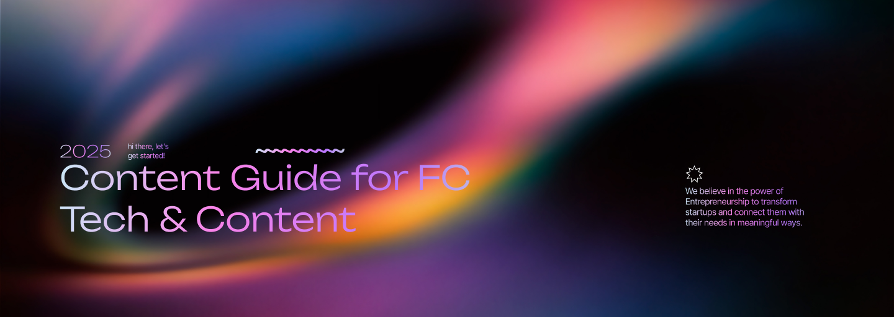
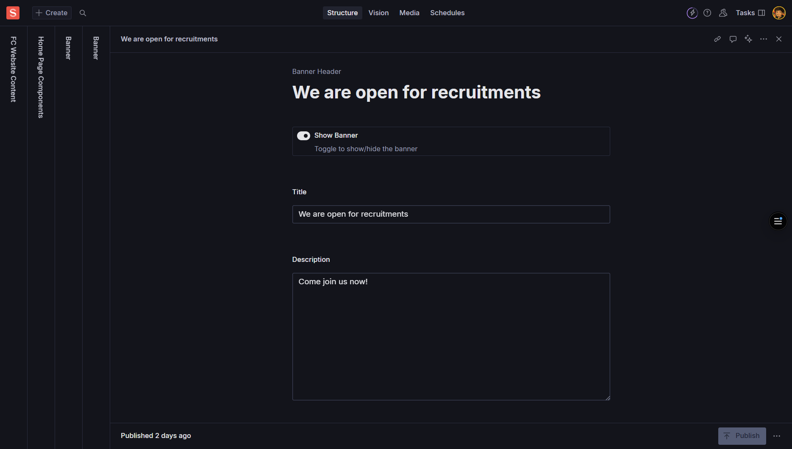
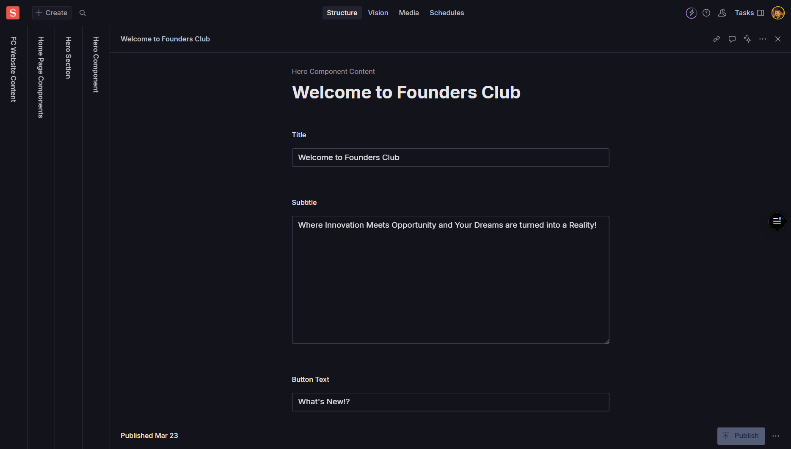
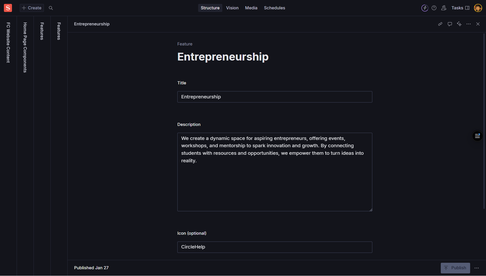
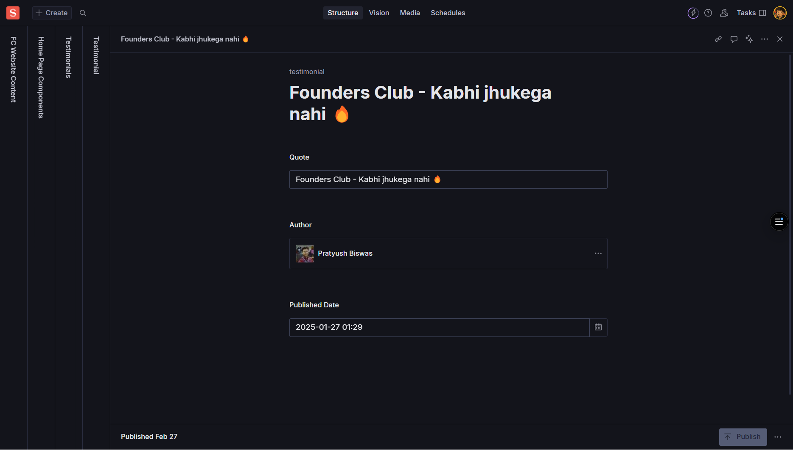
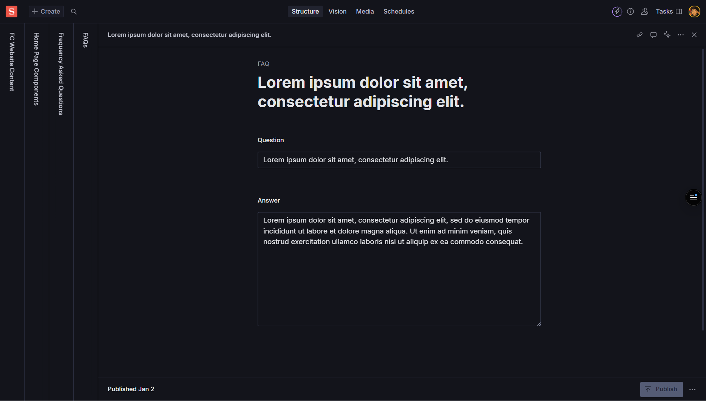
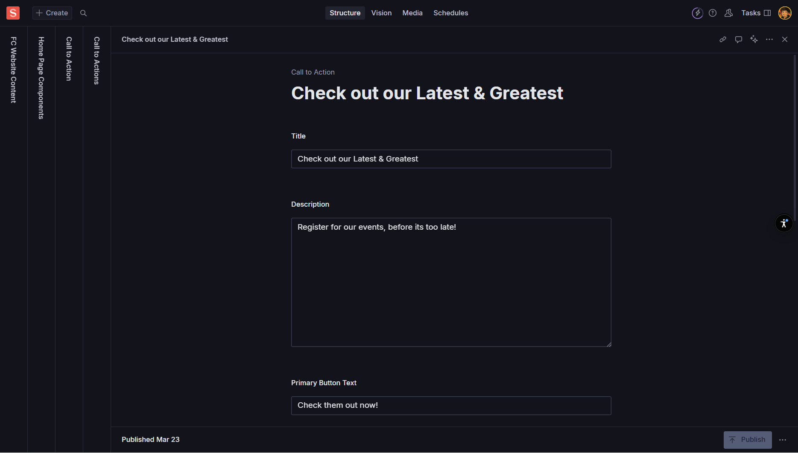

import { Card, CardGrid, Aside, Icon, LinkCard } from '@astrojs/starlight/components';
import { Quiz, QuizOption, List } from 'starlight-videos/components';

<Aside type="tip" icon="star">
  <b>For Content & Creative Teams</b>  
  This guide covers all home page components in the order they appear: Banner → Hero → Features → Testimonials → Help → Call to Action (CTA)
</Aside>

## Overview

The home page is the first impression visitors get of Founders Club. This guide walks you through each component section, explaining what they do, what fields to fill out, and best practices for content creation.

<CardGrid>
  <Card title="6 Main Components" icon="list-format">
    Banner, Hero, Features, Testimonials, Help Section, and Call to Action
  </Card>
  <Card title="User-Friendly Fields" icon="pencil">
    Each component has intuitive fields designed for non-technical users
  </Card>
  <Card title="Instant Preview" icon="magnifier">
    See changes in Sanity Studio before publishing to the live site
  </Card>
</CardGrid>

---

## Banner Component

### What is the Banner?

The Banner is a prominent strip at the top of the page that highlights key information or timely messages. Perfect for announcements, promotions, or important updates.

### Fields to Fill Out

<CardGrid>
  <Card title="Title" icon="pencil">
    **Required** - A short headline (aim for under 60 characters)
     *Example: "Welcome to Founders Club 2025!"*
  </Card>
  <Card title="Subtitle/Tagline" icon="document">
    **Optional** - A supporting line below the title
     *Example: "Join India's premier startup community"*
  </Card>
  <Card title="Description" icon="open-book">
    **Optional** - One or two brief sentences for context
     *Example: "Connect with like-minded entrepreneurs and grow your startup"*
  </Card>
  <Card title="Background Image" icon="seti:image">
    **Optional** - Wide image (min 1600px width recommended)
     *Always add descriptive Alt Text*
  </Card>
</CardGrid>

### Advanced Options

<CardGrid>
  <Card title="Background Color" icon="seti:color">
    **Optional** - HEX color like #112233
     *Note: If both image and color are set, image usually takes priority*
  </Card>
  <Card title="Text Alignment" icon="setting">
    **Options**: left, center, right
     *Controls how text appears inside the banner*
  </Card>
  <Card title="Banner Size" icon="seti:size">
    **Options**: small, medium, large
     *Controls visual height and spacing*
  </Card>
  <Card title="Visibility Toggle" icon="approve-check">
    **Boolean** - Turn banner on/off without deleting content
  </Card>
</CardGrid>

### How to Edit the Banner

1. **Navigate** to the home page document in Sanity Studio
2. **Find** the "Banner" section (or similar naming)
3. **Toggle** it on if not already active
4. **Fill** the Title field (required)
5. **Add** optional Subtitle and Description
6. **Upload** background image with Alt Text OR choose a background color
7. **Set** alignment and size preferences
8. **Add** CTA button if needed (see CTA section)
9. **Publish** your changes

<Aside type="note" icon="information">
  **Best Practice**: Use either a background image OR a color. Using both is fine, but the design may prioritize the image.
</Aside>

---

## Hero Component

### What is the Hero Section?

The Hero is the main focal point near the top of the page. It's typically larger and more visual than the banner, designed to make a strong first impression with compelling messaging and imagery.

### Fields to Fill Out

<CardGrid>
  <Card title="Heading" icon="pencil">
    **Required** - The main statement; keep concise and impactful
     *Example: "Build Your Startup Dreams Into Reality"*
  </Card>
  <Card title="Subheading" icon="document">
    **Optional** - Supporting line under the heading
     *Example: "Connect, Learn, and Grow with India's Top Entrepreneurs"*
  </Card>
  <Card title="Body/Description" icon="open-book">
    **Optional** - 1–3 short sentences providing context
     *Rich text formatting available*
  </Card>
  <Card title="Media" icon="seti:image">
    **Optional** - Large image or video (1600px+ width for images)
     *Always include Alt Text for accessibility*
  </Card>
</CardGrid>

### Layout and Design Options

<CardGrid>
  <Card title="Layout Options" icon="setting">
    **textLeft** - Text on left, media on right
     **textRight** - Text on right, media on left  
     **centered** - Text and media centered
  </Card>
  <Card title="Theme Variants" icon="seti:color">
    **light** - Light background theme
     **dark** - Dark background theme
     **contrast** - High contrast theme
  </Card>
  <Card title="Call to Actions" icon="right-arrow">
    **Array** - Add up to 2 CTA buttons
     *Primary and secondary actions (see CTA section)*
  </Card>
</CardGrid>

### How to Edit the Hero

1. **Open** the home page document
2. **Navigate** to "Hero" section
3. **Fill** the Heading field (keep it impactful)
4. **Add** optional Subheading and Description
5. **Upload** media file with proper Alt Text
6. **Choose** layout (textLeft, textRight, or centered)
7. **Select** theme variant (light, dark, or contrast)
8. **Add** 1-2 CTA buttons if needed
9. **Publish** changes

<Aside type="caution" icon="warning">
  **Video Tip**: If uploading video, you can either upload a file directly or paste an external URL from a CDN. Always provide captions when possible.
</Aside>

---

## Features Component

### What is the Features Section?

The Features section showcases the benefits, capabilities, or key highlights of Founders Club. It presents information in an organized grid or list format.

### Main Section Fields

<CardGrid>
  <Card title="Section Title" icon="pencil">
    **Required** - Main heading for the features section
     *Example: "Why Choose Founders Club"*
  </Card>
  <Card title="Introduction" icon="open-book">
    **Optional** - Brief introductory text
     *Example: "Discover what makes our community special"*
  </Card>
  <Card title="Layout Style" icon="setting">
    **Options**: 2-col, 3-col, 4-col, list
     *3-col is recommended for readability*
  </Card>
  <Card title="Theme" icon="seti:color">
    **Options**: default, tinted, contrast
     *Visual variations for different styles*
  </Card>
</CardGrid>

### Individual Feature Items

Each feature item in the array includes:

<CardGrid>
  <Card title="Item Title" icon="pencil">
    **Required** - Short title (aim for 3-5 words)
     *Example: "Mentorship Programs"*
  </Card>
  <Card title="Item Description" icon="document">
    **Required** - 1-2 sentences (15-30 words ideal)
     *Example: "Get guidance from successful entrepreneurs who've built companies from the ground up."*
  </Card>
  <Card title="Icon/Image" icon="seti:image">
    **Optional** - Small visual representation
     *Use consistent icon style; add Alt Text*
  </Card>
  <Card title="Link/CTA" icon="external">
    **Optional** - If the feature links to a detailed page
  </Card>
</CardGrid>

### Advanced Item Options

<CardGrid>
  <Card title="Highlight/Emphasis" icon="star">
    **Boolean** - Visually emphasize this particular card
     *Use sparingly for most important features*
  </Card>
</CardGrid>

### How to Edit Features

1. **Navigate** to "Features" section in the home page
2. **Set** Section Title and optional Introduction
3. **Choose** Layout (2-col, 3-col, 4-col, or list)
4. **Select** Theme (default, tinted, or contrast)
5. **Add Items** one by one:
   - Fill Item Title (keep short)
   - Write Item Description (1-2 sentences)
   - Upload Icon/Image with Alt Text
   - Add optional link if needed
   - Toggle Highlight if this is a key feature
6. **Publish** your changes

<Aside type="tip" icon="approve-check">
  **Content Tip**: Keep feature descriptions concise and benefit-focused. Use action-oriented language that tells visitors what they'll gain.
</Aside>

---

## Testimonials Component

### What are Testimonials?

Testimonials provide social proof from members, partners, or successful entrepreneurs who have benefited from Founders Club. They build trust and credibility.

### Essential Fields

<CardGrid>
  <Card title="Quote" icon="open-book">
    **Required** - The testimonial text itself
     *Keep natural and authentic; avoid overly long paragraphs*
  </Card>
  <Card title="Author Name" icon="pencil">
    **Required** - Full name of the person
     *Example: "Priya Sharma"*
  </Card>
  <Card title="Role/Title" icon="document">
    **Optional** - Their position or role
     *Example: "Founder & CEO"*
  </Card>
  <Card title="Company/Organization" icon="setting">
    **Optional** - Where they work or what they've built
     *Example: "TechStart Solutions"*
  </Card>
</CardGrid>

### Visual Elements

<CardGrid>
  <Card title="Avatar" icon="seti:image">
    **Optional** - Headshot of the person
     *Add descriptive Alt Text like "Portrait of Priya Sharma"*
  </Card>
  <Card title="Company Logo" icon="seti:image">
    **Optional** - If highlighting their brand
     *Add Alt Text describing the logo*
  </Card>
  <Card title="Rating" icon="star">
    **Optional** - Star rating (1-5)
     *Use if your design supports visual star ratings*
  </Card>
  <Card title="Source Link" icon="external">
    **Optional** - Link to case study or original source
  </Card>
</CardGrid>

### How to Edit Testimonials

1. **Open** the "Testimonials" section
2. **Add** a new testimonial entry
3. **Fill** the Quote field (keep authentic and conversational)
4. **Add** Author Name (required minimum)
5. **Include** Role/Title and Company for credibility
6. **Upload** Avatar and/or Company Logo with Alt Text
7. **Set** optional Rating (1-5 stars)
8. **Add** Source Link if available
9. **Publish** changes

<Aside type="caution" icon="warning">
  **Privacy Note**: If using real testimonials, ensure you have permission. For privacy-sensitive cases, omit Avatar/Logo and consider using first name only.
</Aside>

---

## Help Section Component

### What is the Help Section?

The Help section provides support and assistance to visitors. It typically includes FAQs, contact information, and helpful links to guide users to the resources they need.

### Main Section Fields

<CardGrid>
  <Card title="Section Title" icon="pencil">
    **Required** - Main heading
     *Example: "Need Help?" or "Frequently Asked Questions"*
  </Card>
  <Card title="Introduction" icon="open-book">
    **Optional** - Brief description of available support
     *Example: "Find answers to common questions or get in touch with our team"*
  </Card>
</CardGrid>

### FAQ Entries

<CardGrid>
  <Card title="Question" icon="help">
    **Required** - The question users commonly ask
     *Example: "How do I join Founders Club?"*
  </Card>
  <Card title="Answer" icon="document">
    **Required** - Clear, helpful response
     *Use rich text formatting; keep paragraphs short*
  </Card>
  <Card title="Category/Tag" icon="setting">
    **Optional** - Organize by topic
     *Example: "Membership", "Events", "Billing"*
  </Card>
</CardGrid>

### Helpful Links

<CardGrid>
  <Card title="Link Label" icon="pencil">
    **Required** - Descriptive text for the link
     *Example: "Contact Support", "Member Portal", "Documentation"*
  </Card>
  <Card title="URL" icon="external">
    **Required** - Link destination
     *Internal: select page reference; External: full URL (https://...)*
  </Card>
  <Card title="Open in New Tab" icon="setting">
    **Optional** - Boolean option
     *Use true for external URLs*
  </Card>
</CardGrid>

### Contact Information

<CardGrid>
  <Card title="Contact Details" icon="email">
    **Optional** - Email, phone, business hours
     *Ensure all contact info is current and monitored*
  </Card>
  <Card title="Main CTA" icon="right-arrow">
    **Optional** - Primary action button
     *Example: "Get Support" or "Contact Us"*
  </Card>
</CardGrid>

### How to Edit the Help Section

1. **Navigate** to "Help" section on the page
2. **Fill** Section Title and Introduction
3. **Add FAQ entries**:
   - Write clear Questions
   - Provide helpful Answers (use formatting for readability)
   - Add optional Category tags
4. **Add Helpful Links**:
   - Create descriptive Labels
   - Set correct URLs (internal references or external URLs)
   - Check "Open in New Tab" for external links
5. **Update Contact Info** if applicable
6. **Add** main CTA if needed
7. **Publish** changes

<Aside type="tip" icon="approve-check">
  **Content Strategy**: Keep FAQ answers concise. If a topic is complex, provide a brief answer and link to a more detailed guide or resource page.
</Aside>

---

## Call to Action (CTA) Component

### What is a Call to Action?

A CTA is a button or link that prompts users to take a specific action. CTAs appear throughout various components and are crucial for guiding user behavior.

### Essential CTA Fields

<CardGrid>
  <Card title="Label" icon="pencil">
    **Required** - The button text
     *Example: "Get Started", "Join Now", "Learn More", "Contact Us"*
     *Keep short and action-oriented*
  </Card>
  <Card title="Link Type" icon="setting">
    **Required** - Internal or External
     **Internal**: Page within your site
     **External**: Full URL to another website
  </Card>
  <Card title="URL/Link" icon="external">
    **Required** - The destination
     **Internal**: Choose page reference or enter slug
     **External**: Full URL starting with https://
  </Card>
  <Card title="Style/Variant" icon="seti:color">
    **Required** - Visual emphasis level
     **Primary**: Main action (standout button)
     **Secondary**: Alternative action
     **Outline**: Subtle emphasis
     **Ghost**: Minimal styling
  </Card>
</CardGrid>

### Advanced CTA Options

<CardGrid>
  <Card title="Open in New Tab" icon="external">
    **Optional** - Boolean option
     *Typically true for external links*
  </Card>
  <Card title="Icon" icon="seti:image">
    **Optional** - Small icon next to label
     *Use sparingly and consistently*
  </Card>
</CardGrid>

### CTA Best Practices

<CardGrid>
  <Card title="Action-Oriented Language" icon="pencil">
    Use verbs that tell users exactly what will happen
     *Good*: "Join Now", "Download Guide", "Start Free Trial"
     *Avoid*: "Click Here", "Submit", "Button"
  </Card>
  <Card title="Hierarchy" icon="list-format">
    **Primary**: Most important action (1 per section)
     **Secondary**: Alternative or supporting actions
     *Don't use more than 2 CTAs in one component*
  </Card>
  <Card title="Link Management" icon="setting">
    **Internal Links**: Use page references when possible (less error-prone)
     **External Links**: Always include https:// and verify links work
  </Card>
</CardGrid>

### How to Add/Edit CTAs

1. **Locate** the CTA field within any component
2. **Add** descriptive Label (action-oriented)
3. **Choose** Type (internal or external)
4. **Set** URL/Link:
   - Internal: Select page reference or enter slug
   - External: Paste full URL with https://
5. **Select** Style (Primary, Secondary, Outline, or Ghost)
6. **Check** "Open in New Tab" for external links
7. **Add** optional Icon if needed
8. **Save** and Publish

<Aside type="note" icon="information">
  **Testing Tip**: Always test your CTAs after publishing to ensure they lead to the correct destination and work properly on both desktop and mobile.
</Aside>

---

## Content Guidelines and Best Practices

### Accessibility Standards

<CardGrid>
  <Card title="Alt Text for Images" icon="seti:image">
    Always provide descriptive Alt Text that explains what the image shows
     *Example: "Group photo of Founders Club members at networking event"*
     *Avoid*: "image", "photo", or leaving blank
  </Card>
  <Card title="Color Contrast" icon="seti:color">
    Ensure text is readable against background colors or images
     *Test with high contrast mode enabled*
     *Use tools to verify contrast ratios meet accessibility standards*
  </Card>
  <Card title="Link Descriptions" icon="external">
    Make link text descriptive and meaningful
     *Good*: "Read our membership guide"
     *Avoid*: "Click here" or "Read more"
  </Card>
</CardGrid>

### Content Quality Standards

<CardGrid>
  <Card title="Consistency" icon="approve-check">
    **Tone**: Maintain consistent voice across all sections
     **Capitalization**: Follow title case or sentence case consistently  
     **Punctuation**: Be consistent with periods, exclamation marks
  </Card>
  <Card title="Brevity and Clarity" icon="pencil">
    **Headlines**: Keep under 60 characters when possible
     **Descriptions**: Use 1-3 short sentences
     **Button Text**: 1-3 words maximum
  </Card>
  <Card title="Brand Voice" icon="star">
    Follow Founders Club's established style guide
     *Professional yet approachable tone*
     *Focus on community, growth, and entrepreneurship*
  </Card>
</CardGrid>

### Technical Best Practices

<CardGrid>
  <Card title="Image Optimization" icon="seti:image">
    **Minimum Width**: 1600px for hero/banner images
    **File Format**: Use WebP when possible, JPG/PNG as fallback
    **File Size**: Optimize for web (under 500KB ideally)
  </Card>
  <Card title="Link Management" icon="external">
    **Internal Links**: Use page references to avoid broken links
    **External Links**: Include https:// and verify they work
    **Testing**: Check all links after publishing
  </Card>
  <Card title="Content Preview" icon="magnifier">
    Always preview changes in Sanity Studio before publishing
     *Check how content looks on different screen sizes*
     *Verify all fields are filled correctly*
  </Card>
</CardGrid>

---

## Test Your Knowledge

<Quiz title="What's the recommended maximum character count for banner titles?">
  <QuizOption correct>60 characters</QuizOption>
  <QuizOption>100 characters</QuizOption>
  <QuizOption>30 characters</QuizOption>
</Quiz>

<Quiz title="Which hero layout option places text on the left side?">
  <QuizOption correct>textLeft</QuizOption>
  <QuizOption>leftAlign</QuizOption>
  <QuizOption>textRight</QuizOption>
</Quiz>

<Quiz title="What's the ideal word count for feature item descriptions?">
  <QuizOption>5-10 words</QuizOption>
  <QuizOption correct>15-30 words</QuizOption>
  <QuizOption>50+ words</QuizOption>
</Quiz>

<Quiz title="Which CTA style should be used for the main action in a section?">
  <QuizOption correct>Primary</QuizOption>
  <QuizOption>Secondary</QuizOption>
  <QuizOption>Ghost</QuizOption>
</Quiz>

<Quiz title="What should you always include when adding images?">
  <QuizOption>Copyright notice</QuizOption>
  <QuizOption correct>Alt text description</QuizOption>
  <QuizOption>File size information</QuizOption>
</Quiz>

---

## Quick Reference

### Component Order on Home Page
1. **Banner** - Top announcement or key message
2. **Hero** - Main focal section with primary CTA
3. **Features** - Benefits and capabilities showcase  
4. **Testimonials** - Social proof from members
5. **Help** - FAQ and support resources
6. **CTA** - Final call to action

### Field Priority Guide
- ✅ **Always Required**: Titles, Headings, Author Names (testimonials)
- ⚠️ **Highly Recommended**: Descriptions, Alt Text, CTA Labels
- 📋 **Optional but Valuable**: Images, Icons, Secondary CTAs, Contact Info

<Aside type="tip" icon="star">
  **Remember**: After making any changes, always publish your updates and allow 15-20 minutes for changes to appear on the live website. Test the site after publishing to ensure everything works correctly!
</Aside>

