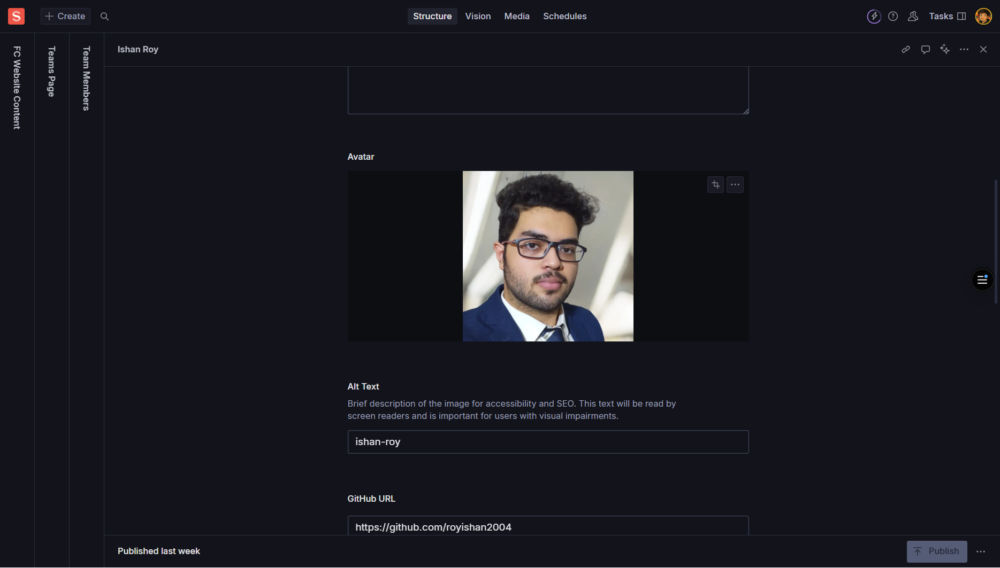

import { Card, CardGrid, Aside, Icon, LinkCard } from '@astrojs/starlight/components';
import { Quiz, QuizOption, List } from 'starlight-videos/components';

<Aside type="tip" icon="star">
  <b>For Content & Creative Teams</b>  
  This guide covers managing team member profiles, including personal information, roles, photos, and social links
</Aside>

<List title="Before you start" variant="caution">
- [ ] Gather high-quality professional headshots (800×800px minimum)
- [ ] Prepare brief team member biographies (40-80 words each)
- [ ] Collect current social media and professional profile URLs
- [ ] Ensure you have permission to use photos and personal information
</List>

<List title="What you'll find in this guide" variant="note">
- Complete team member profile creation and management
- Professional headshot requirements and image specifications
- Social media integration with platform-specific best practices
- Advanced profile management features (featuring, visibility, ordering)
- Biography writing guidelines and professional standards
- Accessibility requirements and content quality standards
</List>

<LinkCard
  title="Author Component Reference"
  href="/guides/fc/studio/components/author"
  description="Shared standards for headshots, biographies, and social media integration across all person profiles."
/>

## Overview

The Teams page showcases the people behind Founders Club - their roles, backgrounds, and expertise. Team member profiles are reusable objects that can appear across different sections of your website, from dedicated team pages to featured member highlights.

<CardGrid>
  <Card title="Individual Profiles" icon="approve-check-circle">
    Each team member has a detailed profile with personal and professional information
  </Card>
  <Card title="Flexible Display" icon="setting">
    Profiles can be featured, hidden, or reordered based on your needs
  </Card>
  <Card title="Social Integration" icon="external">
    Support for multiple social media platforms and professional links
  </Card>
</CardGrid>

---

## Team Member Object

### What is a Team Member Profile?

A Team Member is a reusable object that represents an individual person in your organization. These profiles typically include name, role, headshot, biography, and contact information, and can be displayed on team pages, about sections, or featured member carousels.

### Core Information Fields

<CardGrid>
  <Card title="Name" icon="pencil">
    **Required** - Full name of the person
     *Example: "Priya Sharma" or "Dr. Rajesh Kumar"*
     *Use the person's preferred professional name*
  </Card>
  <Card title="Role/Title" icon="document">
    **Required** - Job title or function
     *Example: "Head of Design", "Community Manager", "Founder & CEO"*
     *Use consistent title formatting across all profiles*
  </Card>
  <Card title="Department/Team" icon="setting">
    **Optional** - Group or discipline
     *Example: "Product Design", "Operations", "Leadership Team"*
     *Helps organize members by functional area*
  </Card>
  <Card title="Bio" icon="open-book">
    **Optional** - Concise personal summary
     *1-3 sentences, 40-80 words ideal*
     *Focus on expertise, background, and what they bring to the team*
  </Card>
</CardGrid>

### Visual and Contact Information

<CardGrid>
  <Card title="Headshot/Image" icon="seti:image">
    **Optional** - Professional photo
     *Square or portrait format (at least 800×800px)*
     *Always add descriptive Alt Text*
     *Example Alt Text: "Portrait of Priya Sharma"*
  </Card>
  <Card title="Email" icon="email">
    **Optional** - Work email address
     *Use only professional/work email addresses*
     *Example: "priya.sharma@foundersclub.com"*
  </Card>
  <Card title="Phone" icon="phone">
    **Optional** - Contact phone number
     *Include only if phone contact is appropriate*
     *Format consistently: "+91 98765 43210"*
  </Card>
  <Card title="Location" icon="setting">
    **Optional** - Work location
     *Examples: "Mumbai, India", "Remote", "Hybrid - Delhi"*
     *Be consistent with location formatting*
  </Card>
</CardGrid>

### Social Media Links

The Social Links array allows multiple social media and professional profiles:

<CardGrid>
  <Card title="Provider/Label" icon="external">
    **Required** - Platform name
     *Examples: "LinkedIn", "Twitter/X", "GitHub", "Website", "Instagram"*
     *Use consistent naming across all profiles*
  </Card>
  <Card title="URL" icon="external">
    **Required** - Full profile URL
     *Must start with https://*
     *Example: "https://linkedin.com/in/suvangs"*
     *Verify links are active and correct*
  </Card>
  <Card title="Icon" icon="seti:image">
    **Optional** - Visual identifier
     *Platform icon or symbol*
     *Use if your schema supports icon selection*
  </Card>
</CardGrid>

### Management and Display Options

<CardGrid>
  <Card title="Featured" icon="star">
    **Optional** - Boolean toggle
     *Highlights the person in special sections or carousels*
     *Use sparingly for key team members*
  </Card>
  <Card title="Visible/Active" icon="approve-check">
    **Optional** - Boolean toggle
     *Controls whether the profile appears on the site*
     *Toggle off to hide without deleting*
  </Card>
  <Card title="Sort Order/Priority" icon="list-format">
    **Optional** - Numerical value
     *Lower numbers appear first in manual ordering*
     *Example: 1, 2, 3, etc.*
  </Card>
  <Card title="Tags" icon="setting">
    **Optional** - Skills or specialties array
     *Examples: "AI", "Fintech", "Operations", "Marketing"*
     *Helps categorize expertise areas*
  </Card>
</CardGrid>

### Advanced Profile Options

<CardGrid>
  <Card title="Slug" icon="external">
    **Optional** - URL-friendly identifier
     *Only needed if individual profile pages exist*
     *Example: "priya-sharma" or "john-doe"*
     *Auto-generated from name in most cases*
  </Card>
  <Card title="Start Date" icon="seti:clock">
    **Optional** - When they joined
     *Useful for tenure information*
     *Format: YYYY-MM-DD*
  </Card>
  <Card title="End Date" icon="seti:clock">
    **Optional** - When they left (if applicable)
     *Can mark as alumni or hide from active display*
     *Format: YYYY-MM-DD*
  </Card>
</CardGrid>

---

## How to Add/Edit Team Members

### Step-by-Step Instructions

1. **Navigate** to team member management in Sanity Studio:
   - Look for "Team Members" array within a page document
   - OR go to a separate "Team" document section
   
2. **Add a new team member**:
   - Click "Add" to create a new profile
   - OR select an existing member to edit

3. **Fill core information**:
   - Enter **Name** (required)
   - Add **Role/Title** (required) 
   - Set **Department/Team** if applicable
   - Write a brief **Bio** (40-80 words recommended)

4. **Upload headshot**:
   - Choose a professional photo (800×800px minimum)
   - Crop to square or portrait as needed
   - Add descriptive **Alt Text** (e.g., "Portrait of John Smith")

5. **Add contact information**:
   - Include work **Email** if appropriate
   - Add **Phone** number if needed
   - Specify **Location** (city, remote, hybrid)

6. **Configure social links**:
   - Add **Provider/Label** (LinkedIn, Twitter, etc.)
   - Include full **URL** starting with https://
   - Select **Icon** if available

7. **Set display options**:
   - Toggle **Featured** for key members
   - Ensure **Visible/Active** is on
   - Set **Sort Order** if using manual ordering
   - Add relevant **Tags** for skills/expertise

8. **Publish** the changes

### Organizing Multiple Team Members

<CardGrid>
  <Card title="Drag and Drop" icon="setting">
    **Reordering** - Drag team members to reorder if supported
     *Use drag handles to arrange profiles*
  </Card>
  <Card title="Manual Ordering" icon="list-format">
    **Sort Order** - Use numerical values for precise ordering
     *Lower numbers (1, 2, 3) appear first*
  </Card>
  <Card title="Department Groups" icon="setting">
    **Organization** - Group by department/team for clarity
     *Consistent department naming helps organization*
  </Card>
</CardGrid>

---

## Image Guidelines and Best Practices

### Professional Headshot Requirements

<CardGrid>
  <Card title="Image Specifications" icon="seti:image">
    **Minimum Size**: 800×800px for crisp display
     **Aspect Ratio**: Square (1:1) or portrait depending on site design
     **Format**: JPG, PNG, or WebP
     **File Size**: Under 500KB for web optimization
  </Card>
  <Card title="Photo Quality Standards" icon="star">
    **Professional Appearance**: Clear, well-lit professional photos
     **Consistent Style**: Similar lighting and background across team
     **Current Photos**: Recent photos that represent the person accurately
  </Card>
  <Card title="Accessibility Requirements" icon="approve-check">
    **Alt Text**: Always include descriptive Alt Text
     *Good*: "Portrait of Sarah Johnson"
     *Avoid*: "headshot", "photo", or leaving blank
  </Card>
</CardGrid>

### Content Quality Guidelines

<CardGrid>
  <Card title="Biography Writing" icon="open-book">
    **Length**: 40-80 words (1-3 sentences)
     **Focus**: Expertise, background, and value to team
     **Tone**: Professional but approachable
     **Avoid**: Internal jargon or overly technical language
  </Card>
  <Card title="Consistency Standards" icon="approve-check">
    **Job Titles**: Use consistent capitalization and formatting
     **Department Names**: Standardize across all profiles
     **Location Format**: Use same format for all members
  </Card>
  <Card title="Contact Information" icon="email">
    **Work Email Only**: Use professional email addresses
     **Current Information**: Ensure all contact details are up-to-date
     **Privacy**: Only include information appropriate for public display
  </Card>
</CardGrid>

---

## Social Media Integration

### Supported Platforms

<CardGrid stagger>
  <Card title="Professional Networks" icon="external">
    **LinkedIn** - Primary professional platform
     **GitHub** - For technical team members
     **Behance/Dribbble** - For designers and creatives
  </Card>
  <Card title="Social Platforms" icon="external">
    **Twitter/X** - Industry thought leadership
     **Instagram** - Behind-the-scenes content
     **YouTube** - Educational or speaking content
  </Card>
  <Card title="Personal/Portfolio" icon="external">
    **Personal Website** - Professional portfolio
     **Blog** - Industry writing and insights
     **Medium** - Published articles and thoughts
  </Card>
</CardGrid>

### Social Link Best Practices

<CardGrid>
  <Card title="Link Quality" icon="approve-check">
    **Complete URLs**: Always use full URLs with https://
     **Active Profiles**: Verify links lead to active, professional profiles
     **Consistency**: Use the same platform names across all profiles
  </Card>
  <Card title="Professional Focus" icon="star">
    **Work-Relevant**: Include platforms relevant to professional role
     **Quality Over Quantity**: Better to have 2-3 quality links than many inactive ones
     **Regular Updates**: Ensure linked profiles are professionally maintained
  </Card>
</CardGrid>

---

## Profile Management Features

### Display Control Options

<CardGrid>
  <Card title="Featured Highlighting" icon="star">
    **Purpose**: Highlights key team members in special sections
     **Usage**: Use for leadership, department heads, or key contributors
     **Limit**: Don't feature too many members to maintain impact
  </Card>
  <Card title="Visibility Toggle" icon="setting">
    **Active Display**: Controls whether profile appears on live site
     **Temporary Hiding**: Turn off without deleting for temporary absence
     **Alumni Management**: Hide former members while preserving data
  </Card>
  <Card title="Manual Ordering" icon="list-format">
    **Sort Priority**: Use numbers to control display order
     **Hierarchy**: Lower numbers appear first (1, 2, 3...)
     **Flexibility**: Easy to reorder without recreating profiles
  </Card>
</CardGrid>

### Advanced Management

<CardGrid>
  <Card title="Tagging System" icon="setting">
    **Skills/Expertise**: Tag members by specialization
     **Filtering**: Enable filtering by expertise areas
     **Examples**: "AI", "Marketing", "Design", "Operations"
  </Card>
  <Card title="Tenure Tracking" icon="seti:clock">
    **Start Date**: Track when members joined
     **End Date**: Mark departure dates for alumni
     **History**: Maintain organizational timeline
  </Card>
  <Card title="Profile Pages" icon="external">
    **Individual URLs**: Create dedicated profile pages if supported
     **SEO Slugs**: URL-friendly identifiers for each member
     **Deep Linking**: Direct links to individual profiles
  </Card>
</CardGrid>

---

## Test Your Knowledge

<Quiz title="What's the recommended word count for team member bios?">
  <QuizOption>20-30 words</QuizOption>
  <QuizOption correct>40-80 words</QuizOption>
  <QuizOption>100+ words</QuizOption>
</Quiz>

<Quiz title="What's the minimum recommended size for headshot images?">
  <QuizOption>400×400px</QuizOption>
  <QuizOption correct>800×800px</QuizOption>
  <QuizOption>1200×1200px</QuizOption>
</Quiz>

<Quiz title="Which fields are required for all team member profiles?">
  <QuizOption>Name, Role, and Email</QuizOption>
  <QuizOption correct>Name and Role/Title only</QuizOption>
  <QuizOption>Name, Role, and Headshot</QuizOption>
</Quiz>

<Quiz title="How should social media URLs be formatted?">
  <QuizOption>Just the username</QuizOption>
  <QuizOption>Domain only</QuizOption>
  <QuizOption correct>Full URL starting with https://</QuizOption>
</Quiz>

<Quiz title="What happens when you set a team member's 'Visible/Active' toggle to off?">
  <QuizOption>The profile is permanently deleted</QuizOption>
  <QuizOption correct>The profile is hidden but data is preserved</QuizOption>
  <QuizOption>The profile shows with a 'hidden' label</QuizOption>
</Quiz>

---

## Content Guidelines and Best Practices

### Professional Standards

<CardGrid>
  <Card title="Photo Consistency" icon="seti:image">
    **Uniform Style**: Use similar lighting and background across all headshots
     **Professional Quality**: Clear, well-lit, current photos
     **Appropriate Cropping**: Square or portrait based on site design
  </Card>
  <Card title="Information Accuracy" icon="approve-check">
    **Current Details**: Ensure all information is up-to-date
     **Consistent Formatting**: Use same format for titles, locations, dates
     **Professional Focus**: Keep content work-appropriate and relevant
  </Card>
</CardGrid>

### Content Writing Tips

<CardGrid>
  <Card title="Biography Writing" icon="open-book">
    **Focus Areas**: Expertise, background, team contribution
     **Tone**: Professional but approachable
     **Length**: 1-3 sentences, scannable format
     **Avoid**: Internal jargon, overly technical language
  </Card>
  <Card title="Social Media Strategy" icon="external">
    **Quality Links**: Active, professional profiles only
     **Platform Relevance**: Choose platforms relevant to role
     **Regular Maintenance**: Keep linked profiles professionally updated
  </Card>
</CardGrid>

### Accessibility and SEO

<CardGrid>
  <Card title="Alt Text Requirements" icon="approve-check">
    Always provide meaningful Alt Text for headshots
     *Example*: "Portrait of Maria Garcia, Head of Marketing"
     *Avoid*: "headshot", "image", or leaving blank
  </Card>
  <Card title="Link Validation" icon="external">
    **URL Testing**: Verify all social media and website links work
     **HTTPS Protocol**: Use secure links (https://) for all external URLs
     **Regular Audits**: Check links periodically for accuracy
  </Card>
</CardGrid>

---

## Quick Reference

### Required Fields Summary
- ✅ **Name** - Full professional name
- ✅ **Role/Title** - Job title or function
- ⚠️ **Headshot** - Recommended for professional appearance
- ⚠️ **Bio** - Brief professional summary (helps visitors understand expertise)

### Optional but Valuable Fields
- **Department/Team** - Helps organize and categorize members
- **Social Links** - Professional networking and portfolio links
- **Location** - Work location information
- **Tags** - Skills and expertise areas
- **Featured Toggle** - Highlight key team members

### Image Specifications
- **Minimum Size**: 800×800px
- **Aspect Ratio**: Square (1:1) or portrait
- **File Size**: Under 500KB
- **Alt Text**: Always required for accessibility

### Social Link Guidelines
- **Complete URLs**: Include full https:// URLs
- **Professional Focus**: Work-relevant platforms only
- **Quality Over Quantity**: 2-3 active, professional links preferred

<List title="What did you learn?" variant="success">
- How to create and manage comprehensive team member profiles
- Professional headshot requirements and image optimization (800×800px minimum)
- Biography writing best practices (40-80 words, professional tone)
- Social media integration across multiple platforms with proper URL formatting
- Advanced profile management (featuring, visibility toggles, manual ordering)
- Content consistency standards for titles, departments, and formatting
- Accessibility requirements including Alt text for all images
- Profile organization strategies using tags, departments, and sort ordering
</List>

<Aside type="tip" icon="star">
  **Management Tip**: Use the Visible/Active toggle to temporarily hide team members during transitions (like onboarding or departure) without losing their profile data. This makes it easy to reactivate profiles if needed.
</Aside>
