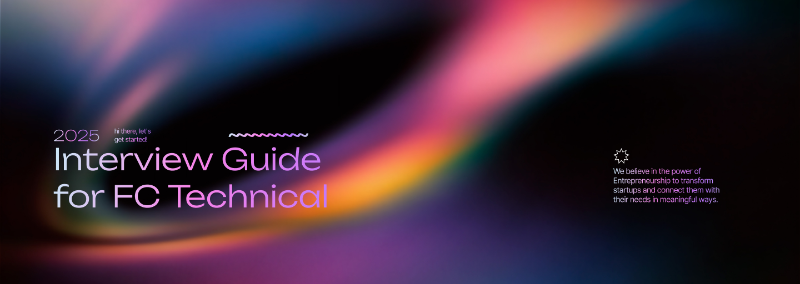

import { Card, CardGrid, Aside, Icon } from '@astrojs/starlight/components';
import { Quiz, QuizOption, List } from 'starlight-videos/components';

<Aside type="tip" icon="star">
  <b>Why this guide?</b>  
  This page is designed to help interviewers and candidates understand what makes a great technical team member at FC, and how to run a fair, effective interview for any technical role.
</Aside>

## What Makes a Good Candidate?

<CardGrid>
  <Card title="Technical Proficiency" icon="open-book">
    Solid understanding of core concepts for their chosen track (Full Stack, Frontend, Backend, React Native, Flutter)
  </Card>
  <Card title="Problem-Solving" icon="puzzle">
    Ability to break down problems, think logically, and find effective solutions
  </Card>
  <Card title="Communication" icon="comment">
    Explains ideas clearly, asks clarifying questions, and collaborates well
  </Card>
  <Card title="Curiosity & Learning" icon="star">
    Willingness to learn, adapt, and grow with the team
  </Card>
  <Card title="Team Fit" icon="approve-check-circle">
    Shares our values of collaboration, responsibility, and continuous improvement
  </Card>
</CardGrid>

<Aside type="note" icon="magnifier">
  <b>How We Test</b> 
  <ul>
    <li>Practical coding challenges relevant to the track</li>
    <li>Scenario-based questions to assess real-world thinking</li>
    <li>Discussion of past projects or experiences</li>
    <li>Soft skills and culture-fit questions</li>
  </ul>
</Aside>

<Aside type="caution" icon="approve-check-circle">
  <b>What We Expect</b> 
  <ul>
    <li>Honesty about strengths and weaknesses</li>
    <li>Willingness to explain thought process</li>
    <li>Openness to feedback</li>
    <li>Enthusiasm for building and learning</li>
  </ul>
</Aside>

---

## <Icon name="list-check-2" /> Interview Guide Skeleton
 > Practical coding challenges relevant to the track

### 1. Pre-Interview Preparation

<CardGrid>
  <Card title="Review" icon="document">
    Review candidate's resume and portfolio
  </Card>
  <Card title="Prepare" icon="list-format">
    Prepare technical questions and challenges for the specific track
  </Card>
  <Card title="Setup" icon="laptop">
    Set up coding environment or online assessment tools
  </Card>
</CardGrid>

## What We Expect

### 2. Interview Structure Overview

<CardGrid>
  <Card title="Welcome" icon="star">
    Welcome and introductions
  </Card>
  <Card title="About Us" icon="information">
    Brief about the club and technical team
  </Card>
  <Card title="Stages" icon="list-format">
    Outline the interview stages
  </Card>
</CardGrid>

### 3. Technical Assessment

<CardGrid>
  <Card title="Full Stack" icon="bars">
    <ul>
      <li>Coding challenge (e.g., build a simple CRUD app)</li>
      <li>Questions on both frontend and backend concepts</li>
    </ul>
  </Card>
  <Card title="Frontend" icon="open-book">
    <ul>
      <li>UI/UX scenario or live coding (e.g., build a component)</li>
      <li>Questions on HTML, CSS, JavaScript, frameworks (React, etc.)</li>
    </ul>
  </Card>
  <Card title="Backend" icon="cloud-download">
    <ul>
      <li>API design or database schema challenge</li>
      <li>Questions on server-side logic, databases, security</li>
    </ul>
  </Card>
  <Card title="React Native App" icon="rocket">
    <ul>
      <li>Mobile UI challenge (e.g., build a simple screen)</li>
      <li>Questions on React Native concepts, navigation, state management</li>
    </ul>
  </Card>
  <Card title="Flutter App" icon="star">
    <ul>
      <li>Dart basics and widget tree challenge</li>
      <li>Questions on Flutter architecture, state management</li>
    </ul>
  </Card>
</CardGrid>

### 4. Problem-Solving & Communication

<Aside type="note" icon="comment-alt">
  <ul>
    <li>Ask candidate to explain their thought process</li>
    <li>Evaluate clarity, logical reasoning, and teamwork skills</li>
  </ul>
</Aside>

### 5. Club Fit & Soft Skills

<Aside type="note">
  <ul>
    <li>Questions about motivation, collaboration, and learning</li>
    <li>Discuss club culture and expectations</li>
  </ul>
</Aside>

### 6. Q&A

<Aside type="tip" icon="information">
  Allow candidate to ask questions about the club or team.
  Introduce them to how we work in the club and let them know about our expectations and returns.
</Aside>

### 7. Evaluation & Next Steps

<Aside type="caution" icon="approve-check">
  <ul>
    <li>Scoring rubric (technical, communication, fit)</li>
    <li>How decisions are made and communicated</li>
  </ul>
</Aside>
### Resources

<Aside type="note" icon="information">
  Links to sample questions, coding platforms, and club documentation
  - [CodeSandbox](https://codesandbox.io) Test Basic Backend / Full Stack
  - [CodePen](https://codepen.io) Test Frontend
  - [StackBlitz](https://stackblitz.com) Test React native (if not setup on system)
  - [Playcode](https://playcode.io) Quick prototyping for React and JavaScript
  - [React Playground](https://react-playground.js.org) Interactive React component testing
  - [React Roadmap Questions](https://roadmap.sh/questions/react) React questions with a escalating difficulty
  - [Reactbit Questions](https://www.interviewbit.com/react-interview-questions) Sample interview questions
</Aside>

---

<List title="What did you learn?" variant='success'>
<li>How to assess traits </li>
<li>How to run a fair assessment using practical challenges, scenarios, past-project discussion, and soft-skill checks.</li>
<li>How to structure the interview</li>
<li>Work with track-specific criteria for Full Stack, Frontend, Backend, etc </li>
</List>

---

<h3>Ready for a short quiz?</h3>

<Quiz title="What matters most in a technical candidate for FC?" multiple>
  <QuizOption correct>Speed of coding</QuizOption>
  <QuizOption correct>Problem-solving and communication</QuizOption>
  <QuizOption correct>Number of GitHub stars</QuizOption>
</Quiz>

<Quiz title="Which is NOT recommended in pre-interview preparation?">
  <QuizOption>Review the candidate's resume and portfolio</QuizOption>
  <QuizOption>Prepare role-specific technical questions</QuizOption>
  <QuizOption correct>Skip setting up the coding environment</QuizOption>
</Quiz>

<Quiz title="During the technical assessment, what should interviewers focus on?">
  <QuizOption>Only the final answer</QuizOption>
  <QuizOption correct>The candidate's thought process and approach</QuizOption>
  <QuizOption>How fast they finish</QuizOption>
</Quiz>

<Quiz title="Why discuss club culture and expectations?">
  <QuizOption>To extend the interview time</QuizOption>
  <QuizOption correct>To assess team fit and alignment with values</QuizOption>
  <QuizOption>It's optional and not useful</QuizOption>
</Quiz>

<Quiz title="If a candidate doesn't know an answer, what's best?">
  <QuizOption>End the interview</QuizOption>
  <QuizOption correct>Ask them to explain their thinking and approach</QuizOption>
  <QuizOption>Ignore the question</QuizOption>
</Quiz>

<Quiz title="Good way to evaluate soft skills?">
  <QuizOption>Give only hard coding problems</QuizOption>
  <QuizOption correct>Ask about teamwork, feedback, and learning experiences</QuizOption>
  <QuizOption>Skip soft skills entirely</QuizOption>
</Quiz>

